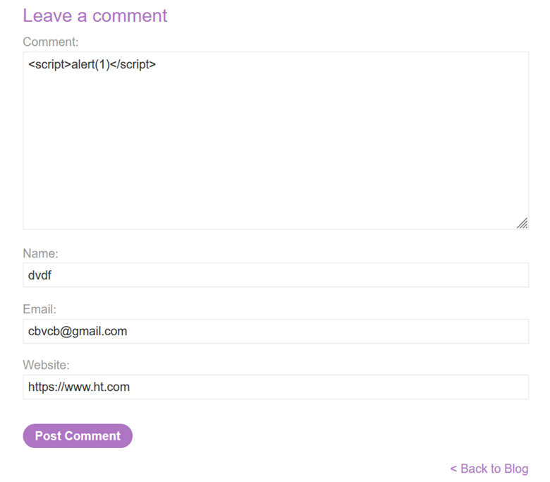

## LAB-2 STORED XSS INTO HTML CONTEXT WITH NOTHING ENCODED

## LAB : [PortSwigger Lab 2 Link](https://portswigger.net/web-security/cross-site-scripting/stored/lab-html-context-nothing-encoded)

## What?

This lab contains a **Stored Cross-Site Scripting (XSS)** vulnerability in the comment functionality.

Unlike reflected XSS, the malicious payload is **stored by the application** and executed whenever the affected blog post is viewed.

The objective is to submit a comment that calls the `alert` function when the blog post is viewed.

## Where?

* **Page:** Blog post
* **Method:** POST (comment submission)
* **Parameter:** Comment field
* **Authentication:** Not required
* **Context:** HTML
* **Vulnerable functionality:** Comment section

## How did I find it?

The blog post contains a comment functionality where user-controlled input is submitted and stored by the application.

I tested whether HTML/JavaScript could be inserted into the comment field.

The following payload was accepted:

```html id="4zq1mx"
<script>alert(1)</script>
```

The application stored the submitted content instead of safely encoding it.

## How did I verify it?

Entered the following payload into the comment box:

```html id="u7m2kd"
<script>alert(1)</script>
```



Then:

1. Entered a name, email, and website.
2. Clicked **Post comment**.
3. Returned to the blog post.
4. The stored JavaScript executed automatically when the page loaded.
5. An `alert` dialog appeared, confirming the stored XSS vulnerability.

## What happens?

The attack flow is:

```text id="g5n8pc"
Attacker submits malicious comment
              ↓
Application stores the comment
              ↓
Comment is displayed on the blog
              ↓
Browser parses the stored HTML
              ↓
<script> executes
              ↓
alert(1) appears
```

The payload is **stored rather than reflected immediately**.

An interesting observation from the lab was that the saved comment appeared as an **empty comment** in the comment section.


This happens because the stored content was a `<script>` element rather than visible text. The script executes every time the blog page loads, so there is no normal comment text displayed.

## Why does it work?

The application stores user-controlled comment content and later places it directly into an **HTML context without encoding**.

Because the payload contains a valid `<script>` element:

```html id="9u6kxr"
<script>alert(1)</script>
```

the browser interprets it as executable HTML/JavaScript instead of displaying it as text.

The key vulnerability is the application's failure to safely encode untrusted stored data before rendering it back to users.

## What can an attacker do?

Stored XSS can potentially have a larger impact than reflected XSS because the malicious payload remains in the application and can execute whenever users visit the affected page.

Depending on the application and victim privileges, an attacker could:

* Execute arbitrary JavaScript in a victim's browser context.
* Modify webpage content.
* Perform actions on behalf of authenticated users.
* Access information available to JavaScript within the application's origin.
* Target multiple users who view the affected page.
* Modify forms or interfaces for phishing.
* Chain the XSS with other application vulnerabilities.

The exact impact depends on the application's functionality and security controls.

## What are the conditions/limitations?

* The application must store attacker-controlled input.
* The stored input must later be rendered to users.
* The stored content must reach an executable HTML context without proper encoding.
* A victim must visit the affected page for the payload to execute.
* Browser security controls and application defenses can limit the impact.
* This lab is intentionally vulnerable because the HTML content is not encoded.

## How should it be fixed?

**Primary:** Apply proper context-aware output encoding when rendering stored user input.

**Defense-in-depth:**

* Treat all user-submitted comments as untrusted data.
* HTML-encode stored content before rendering it.
* Use secure templating frameworks that automatically perform output encoding.
* Avoid inserting untrusted content directly into HTML.
* Validate input where appropriate, but do not rely on filtering alone.
* Implement a strong **Content Security Policy (CSP)** as an additional layer of defense.
* Apply secure output handling consistently to all user-generated content.

## What did I learn?

I learned the key difference between **reflected XSS and stored XSS**.

In the previous lab, the payload was reflected through the search functionality. Here, the payload is **persisted by the application** and executes whenever the vulnerable page is loaded.

The most important concept was:

> **Stored XSS turns user input into persistent executable content.**

I also learned that a stored XSS payload does not necessarily appear as visible text. In this lab, the comment appeared empty because the stored content consisted of a `<script>` element that executed when the page loaded.

## What was the key obstacle?

There was no major technical obstacle.

The important observation was understanding why the comment appeared empty after submitting the payload.

The stored payload:

```html id="x1w4pz"
<script>alert(1)</script>
```

was present in the page but did not produce visible comment text because the browser interpreted it as a script element.

The JavaScript executed whenever the blog post was loaded, confirming that the payload was **stored and persistently executed**.
