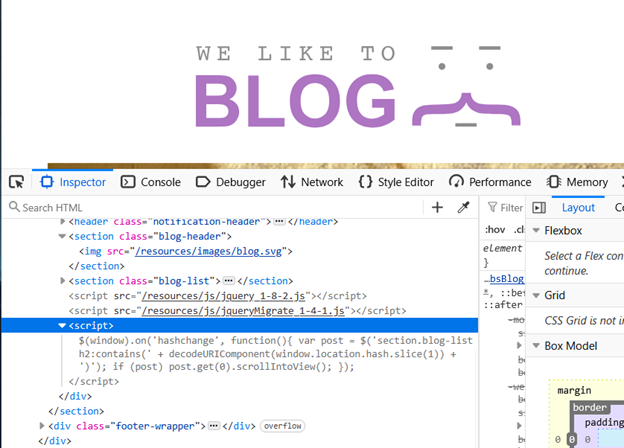
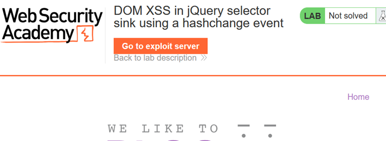
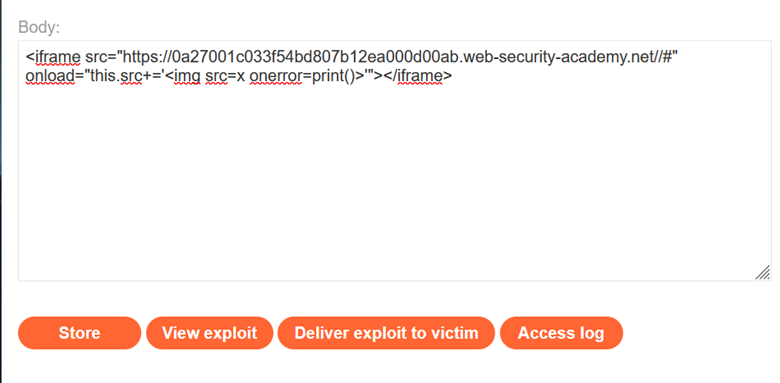

# LAB-6 DOM XSS in jQuery Selector Sink Using Hashchange Event

## LAB : [PortSwigger Lab 6 Link](https://portswigger.net/academy/labs/launch/b73aad4efa87dfe5458720e5a4713f2b416825e550dc9d161f58635db7a48dcd?referrer=%2fweb-security%2fcross-site-scripting%2fdom-based%2flab-jquery-selector-hash-change-event)

## What?

This lab contains a **DOM-based cross-site scripting (XSS)** vulnerability on the home page.

The application uses jQuery's `$()` selector function to automatically scroll to a specific blog post. The post title is taken from the URL's `location.hash` property.

The goal is to deliver an exploit to the victim that causes the `print()` function to execute in their browser.

## Where?

* **Page:** Home page
* **Source:** `location.hash`
* **Sink:** jQuery `$()` selector
* **Event:** `hashchange`
* **Functionality:** Automatically scroll to a blog post
* **Authentication:** Not required
* **Required interaction:** Victim must receive and access the exploit

## How did I find it?

I inspected the JavaScript on the home page using **Burp Suite / browser DevTools**.

The application uses the URL fragment from `location.hash` when constructing a jQuery selector.

The vulnerable behavior is triggered when the URL hash changes, which causes the application to process attacker-controlled data through the jQuery selector.

This indicated a potential DOM XSS vulnerability.

## How did I verify it?

The lab requires the `print()` function to execute in the victim's browser.

Because the exploit needs to be delivered to the victim, I used the lab's **Exploit Server**.

In the **Body** section, I added the following malicious iframe:

`<iframe src="https://YOUR-LAB-ID.web-security-academy.net/#" onload="this.src+=''"></iframe>`

I then:

1. Stored the exploit.
2. Clicked **View exploit** to verify that `print()` was executed.
3. Returned to the exploit server.
4. Clicked **Deliver to victim**.

The lab was then solved.

## What happens?

The exploit uses an iframe to load the vulnerable lab page.

Initially, the iframe loads the page with an empty hash:

`https://YOUR-LAB-ID.web-security-academy.net/#`

When the iframe finishes loading, its `onload` handler executes:

`this.src+=''`

This changes the iframe URL and introduces the malicious content into the URL fragment.

The application's hashchange logic processes the new `location.hash` value through the vulnerable jQuery selector.

The injected HTML contains:

``

The invalid image source causes the `onerror` event to fire, which executes:

`print()`

The overall execution flow is:

`location.hash` → `hashchange` event → jQuery `$()` selector → injected HTML → `` error → `onerror` → `print()`

## Why does it work?

The vulnerability exists because attacker-controlled data from `location.hash` is passed into a jQuery selector without being safely handled.

The application expects the hash to identify a blog post, but the attacker can manipulate the value.

The hashchange event causes the vulnerable code to process the modified hash. By carefully constructing the URL and using the iframe's `onload` event, the exploit causes attacker-controlled markup to reach the vulnerable selector.

The injected image then uses an error event handler to execute `print()`.

## Why is the iframe needed?

The lab is designed around delivering the exploit to a **victim**.

The iframe provides a way to load the vulnerable page and then modify its URL fragment automatically.

The important part is:

`onload="this.src+='...'"

`

After the vulnerable page loads, the iframe changes its own `src`, causing the hash to change and triggering the vulnerable `hashchange` behavior.

This allows the exploit to execute without requiring the victim to manually modify the URL.

## What can an attacker do?

If an attacker can successfully exploit this vulnerability against another user, arbitrary JavaScript execution may occur in the context of the vulnerable application.

Depending on the application's security controls and the victim's privileges, this could potentially allow:

* Accessing sensitive information available to JavaScript
* Performing actions as the victim
* Manipulating page content
* Stealing information accessible to the script
* Chaining the XSS with other application vulnerabilities

## What are the conditions/limitations?

* The application must process attacker-controlled `location.hash` data through a vulnerable jQuery selector.
* The hashchange event must trigger the vulnerable code.
* The attacker needs a way to deliver the malicious URL to a victim.
* The exploit must be compatible with the browser and the vulnerable jQuery behavior.
* The victim needs to load the attacker-controlled exploit for the payload to execute.

## How should it be fixed?

* Never pass untrusted `location.hash` data directly into jQuery selectors.
* Validate the hash value against an allowlist of expected post identifiers.
* Treat URL fragments as untrusted input.
* Avoid dynamically constructing selectors from attacker-controlled data.
* Use safe DOM APIs instead of interpreting user-controlled values as selectors or HTML.
* Use a strong **Content Security Policy (CSP)** as defense-in-depth.

## What did I learn?

* `location.hash` is another important **DOM XSS source**.
* DOM XSS can be triggered through browser events such as `hashchange`.
* jQuery's `$()` selector can become dangerous when attacker-controlled data is used to construct selectors.
* An exploit does not always require the victim to directly enter the payload.
* An iframe can be used to automatically load a vulnerable page and manipulate its URL fragment.
* `` can execute JavaScript through an image-loading error.
* Exploit Server is useful for testing vulnerabilities that require **victim interaction**.

## What was the key obstacle?

The main challenge was understanding the complete exploit chain.

Unlike the previous labs, the vulnerable input is not simply placed directly into an obvious HTML attribute. The attack depends on the interaction between:

`location.hash` → `hashchange` → jQuery `$()` selector → injected markup → event handler

The additional challenge was delivering the exploit to the victim, which is why the **Exploit Server** and iframe were used.
