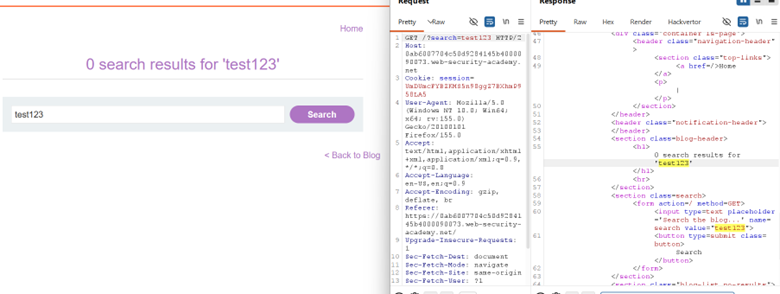
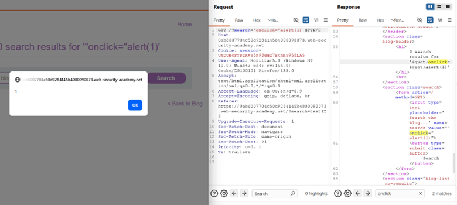
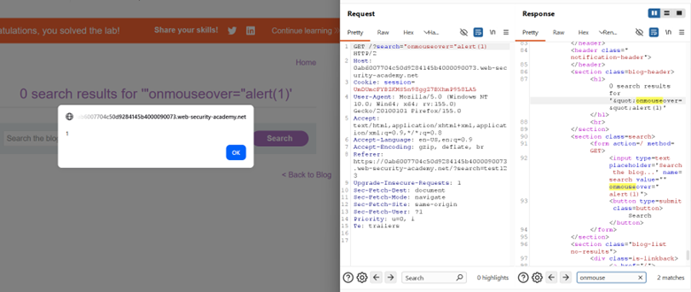

# LAB-7 Reflected XSS into Attribute with Angle Brackets HTML-Encoded

## LAB : [PortSwigger Lab 7 Link](https://portswigger.net/academy/labs/launch/8db2d4d5d579849ca64098e4415c35888c0af17e8f9b0849462456d7b14b8087?referrer=%2fweb-security%2fcross-site-scripting%2fcontexts%2flab-attribute-angle-brackets-html-encoded)

## What?

This lab contains a **reflected cross-site scripting (XSS)** vulnerability in the blog's search functionality.

The application HTML-encodes angle brackets, meaning normal HTML tag injection such as ``

will not create an actual script element because the angle brackets are encoded.

However, the application does not sufficiently protect the **quoted attribute context**.

Because the attacker can inject a quotation mark, they can terminate the existing attribute value:

`"`

and then introduce another attribute containing JavaScript:

`onmouseover="alert(1)"`

This demonstrates an important XSS principle:

**HTML encoding alone is not sufficient if the application fails to correctly handle the specific output context.**

## Important Observation

The first payload:

`"onclick="alert(1)`

was able to trigger an alert locally, but it did not solve the lab.

This demonstrates that **local execution is not always enough to prove that an exploit will work in the intended victim scenario**.

Testing different event handlers can be necessary because browser behavior and the victim's interaction with the page can affect whether the payload executes.

The successful payload was:

`"onmouseover="alert(1)`

## What can an attacker do?

If this vulnerability were exploitable against another user, an attacker could potentially execute JavaScript in the security context of the vulnerable application.

Depending on the application's security controls and the victim's privileges, this could potentially allow:

* Performing actions as the victim
* Accessing sensitive information available to JavaScript
* Manipulating page content
* Stealing information accessible to the script
* Chaining the XSS with other vulnerabilities

## What are the conditions/limitations?

* The search input must be reflected into an HTML attribute.
* The attribute must remain vulnerable to quote-based breakout.
* The attacker needs to bypass or work within the application's encoding behavior.
* The injected event handler must execute in the victim's browser.
* The victim may need to interact with the affected element for the chosen event handler to fire.

## How should it be fixed?

* Apply proper **context-aware output encoding** for HTML attributes.
* Correctly encode quotation marks such as `"` and `'` when inserting untrusted data into attributes.
* Use safe templating mechanisms that automatically perform context-appropriate encoding.
* Avoid constructing HTML with untrusted input.
* Use a strong **Content Security Policy (CSP)** as defense-in-depth.

## What did I learn?

* Always determine **where the input is reflected** before choosing an XSS payload.
* A random value such as `test123` is useful for identifying the exact reflection context.
* Being inside `value="..."` means the input is in a **quoted attribute context**.
* If angle brackets are encoded, `<script>` injection may not work.
* A quotation mark can sometimes escape the existing attribute.
* Event-handler attributes can provide JavaScript execution without injecting a new HTML tag.
* A payload that executes locally may still fail to satisfy the victim/exploit condition.
* The correct XSS payload depends on the **context, encoding, browser behavior, and required user interaction**.

## What was the key obstacle?

The main obstacle was that:

`"onclick="alert(1)`

successfully triggered an alert in my browser but did not solve the lab.

The important lesson was that **finding an executable payload is not always the same as finding a payload that works in the intended victim context**.

After testing another event handler, the payload:

`"onmouseover="alert(1)`

successfully executed in the required context and solved the lab.
