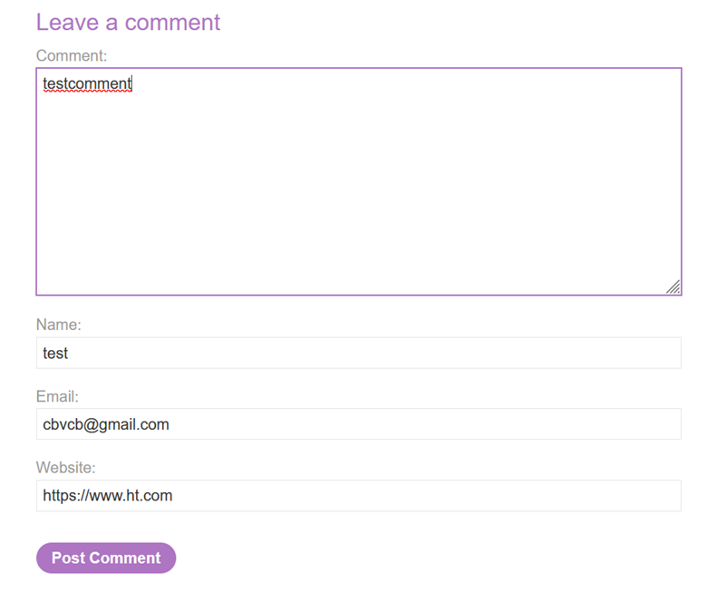
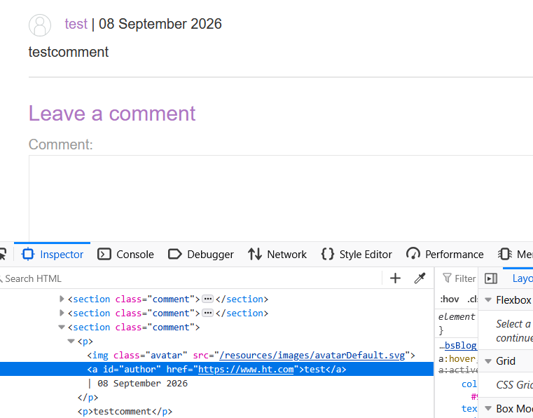
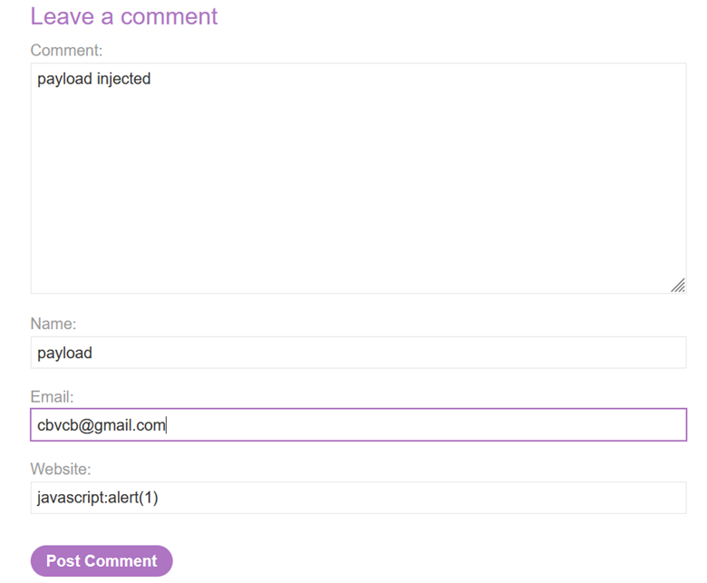
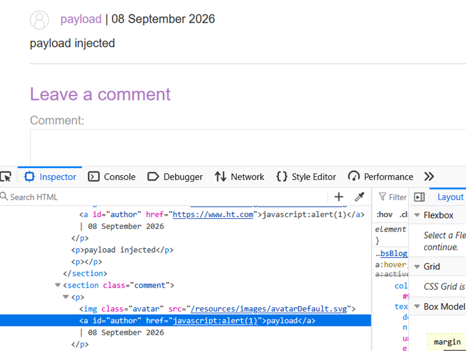

# LAB-8 Stored XSS into Anchor `href` Attribute with Double Quotes HTML-Encoded

## LAB : [PortSwigger Lab 8 Link](https://portswigger.net/academy/labs/launch/837b80f7b6cb679ddb307a046af6df7c851399e3337726434ac2681cba79f639?referrer=%2fweb-security%2fcross-site-scripting%2fcontexts%2flab-href-attribute-double-quotes-html-encoded)

## What?

This lab contains a **stored cross-site scripting (XSS)** vulnerability in the comment functionality.

The goal is to submit a comment containing a malicious value in the **Website** field so that clicking the comment author's name executes the `alert()` function.

The application HTML-encodes double quotes, but the `href` attribute still accepts a JavaScript URL scheme.

## Where?

* **Functionality:** Blog comments
* **Input:** Website field
* **Sink:** Anchor `href` attribute
* **Context:** URL / `href` attribute
* **Storage:** Comment data is stored and displayed later
* **Authentication:** Not required
* **Type:** Stored XSS

## How did I find it?

First, I posted a comment using a random alphanumeric string in the **Website** input.

I then viewed the blog post again and inspected the generated comment using **Burp Suite / browser DevTools**.

The random value appeared inside an anchor `href` attribute associated with the comment author's name.

For example, the comment author name was effectively linked using a structure similar to:

`<a href="http://www.ht.com">Comment Author</a>`

This showed that the **Website** input was being stored and later used as the destination of the author's link.

## How did I verify it?

I repeated the testing process, but replaced the Website input with:

`javascript:alert(1)`

After submitting the comment and viewing the post again, the payload was stored in the comment.

The resulting author link contained the JavaScript URL.

When I clicked the comment author's name, the `alert(1)` function executed.

This confirmed the stored XSS vulnerability.

## What happens?

The Website value is stored as part of the comment.

When the blog post is viewed again, the application retrieves the stored value and places it into the author's anchor:

`<a href="javascript:alert(1)">Comment Author</a>`

When the user clicks the author's name, the browser interprets the `javascript:` URL and executes:

`alert(1)`

The execution flow is:

`Website input → stored in comment → reflected into href → javascript: URL → click author name → JavaScript execution`

## Why does it work?

The vulnerability exists because the application allows attacker-controlled data to be stored and later placed into an anchor's `href` attribute.

Although double quotes are HTML-encoded, the attacker does not need to escape the existing attribute.

Instead, the entire value can be a valid URL using the `javascript:` scheme:

`javascript:alert(1)`

This demonstrates that **HTML encoding and URL validation solve different problems**.

Encoding quotation marks can prevent breaking out of an attribute, but it does not make every possible URL value safe.

## Important Observation

I first tested the Website field with a random value to determine where the input was being used.

The random value appeared as an `href` associated with the comment author's name.

This established the injection context before testing an XSS payload.

The successful payload was:

`javascript:alert(1)`

Unlike the previous reflected `href` lab, this vulnerability is **stored** because the malicious value is saved with the comment and executed later when the stored comment is viewed and the author name is clicked.

## What can an attacker do?

If an attacker could store a malicious JavaScript URL in a real application, they could potentially execute JavaScript in the security context of the vulnerable website when another user activates the affected link.

Depending on the application's security controls and the victim's privileges, this could potentially allow:

* Performing actions as the victim
* Accessing sensitive information available to JavaScript
* Manipulating page content
* Stealing information accessible to the script
* Chaining the XSS with other vulnerabilities

## What are the conditions/limitations?

* The Website input must be stored by the application.
* The stored value must later be placed into an anchor's `href`.
* Dangerous URL schemes such as `javascript:` must not be blocked.
* The victim must view the affected comment.
* The victim must click the comment author's name for this particular payload to execute.

## How should it be fixed?

* Validate the Website field as a URL before storing or using it.
* Allow only safe URL schemes such as `https:` and, where appropriate, `http:`.
* Explicitly reject dangerous schemes such as `javascript:`.
* Apply context-aware output encoding.
* Do not assume HTML-encoding alone makes URLs safe.
* Use safe templating mechanisms for user-generated content.
* Use a strong **Content Security Policy (CSP)** as defense-in-depth.

## What did I learn?

* Stored XSS can occur through fields that do not initially look like HTML injection points.
* The **Website** field became the dangerous sink because its value was stored and later placed inside an `href`.
* Random input is useful for identifying the exact reflection/storage context.
* HTML-encoding double quotes does not prevent dangerous URL schemes.
* `javascript:` can execute JavaScript when used as an anchor's `href`.
* The victim interaction matters because the payload executes when the affected link is clicked.
* **Stored XSS** differs from reflected XSS because the malicious input persists and is delivered when the stored content is viewed.

## What was the key obstacle?

The main challenge was first identifying where the Website input was being used.

After submitting a random value and inspecting the rendered comment, I found that the value was placed inside an anchor `href` associated with the comment author's name.

Once the `href` context was identified, the appropriate payload was:

`javascript:alert(1)`

Clicking the comment author's name then triggered the alert and solved the lab.
