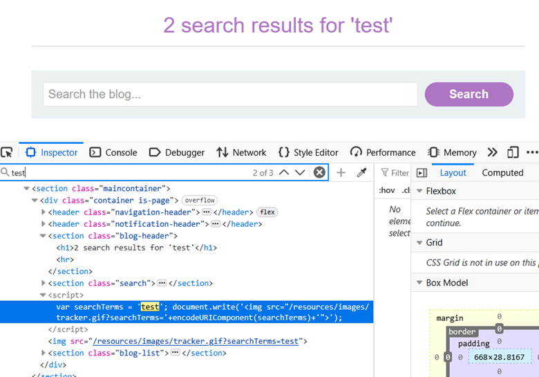
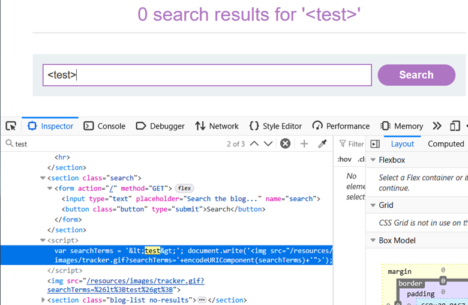
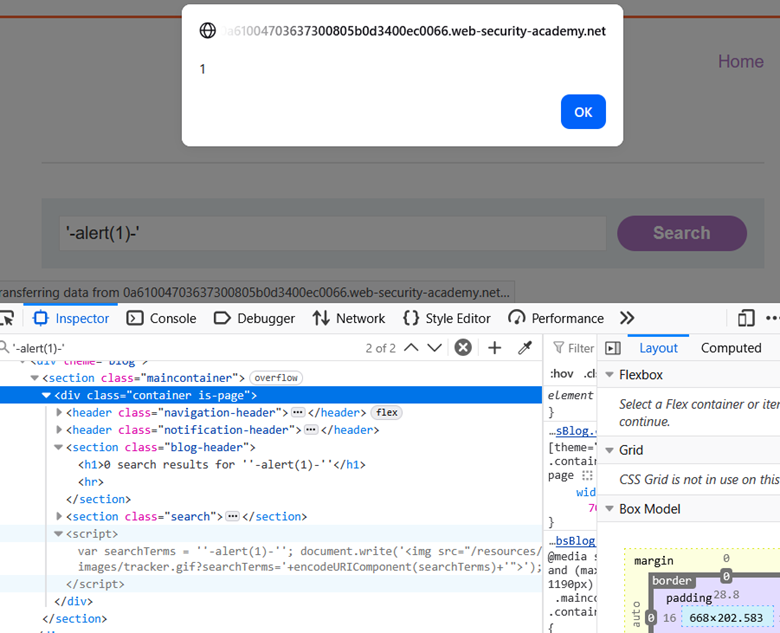

# LAB-9 Reflected XSS into a JavaScript String with Angle Brackets HTML-Encoded

## LAB : [PortSwigger Lab 9 Link](https://portswigger.net/academy/labs/launch/164e6fe824ef894ffa05160602259af63f6266c2e82f19714daf79a0be75e363?referrer=%2fweb-security%2fcross-site-scripting%2fcontexts%2flab-javascript-string-angle-brackets-html-encoded)

## What?

This lab contains a **reflected cross-site scripting (XSS)** vulnerability in the search query tracking functionality.

The application reflects the search input inside a **JavaScript string**. Angle brackets are HTML-encoded, so directly injecting HTML tags such as ``

would not create an executable script element.

I then used the payload:

`'-alert(1)-'`

The payload successfully broke out of the original JavaScript string and caused `alert(1)` to execute.

## What happens?

The original JavaScript is effectively:

`var searchTerms = 'test';`

The important part is that the attacker-controlled input is inside:

`'USER_INPUT'`

The payload:

`'-alert(1)-'`

introduces a single quote to terminate the original JavaScript string.

Conceptually, the resulting code becomes similar to:

`var searchTerms = ''-alert(1)-'';`

The original string is therefore closed, allowing the injected expression:

`alert(1)`

to execute as JavaScript.

The surrounding `-` operators make the injected code part of a valid JavaScript expression.

The execution flow is:

`Search input → reflected into JavaScript string → escape ' → inject JavaScript expression → alert(1)`

## Why does it work?

The vulnerability exists because the application places attacker-controlled input directly inside a JavaScript string without correctly escaping the characters that are meaningful in that JavaScript context.

Although `<` and `>` are HTML-encoded, that protection is focused on HTML characters.

The JavaScript string can still be broken using a single quote:

`'`

Because the application uses:

`var searchTerms = 'USER_INPUT';`

the attacker can terminate the string and introduce JavaScript syntax.

This demonstrates that **encoding must match the context in which the data is inserted**.

## Why didn't ``

does not work because the application HTML-encodes the angle brackets.

For example:

`<test>`

becomes:

`&lt;test&gt;`

Therefore, the browser does not interpret the input as an HTML tag.

More importantly, the vulnerable context is not an HTML body. The input is inside a **JavaScript string**, so the appropriate approach is to escape the JavaScript string rather than inject an HTML element.

## Important Observation

The key discovery was identifying the exact reflection context.

The input initially appeared as:

`var searchTerms = 'test';`

This immediately showed that the search value was inside a single-quoted JavaScript string.

Testing:

`<test>`

confirmed that angle brackets were encoded:

`&lt;test&gt;`

Therefore, instead of continuing to test HTML tags, I changed the approach and targeted the JavaScript string delimiter.

The successful payload was:

`'-alert(1)-'`

## What can an attacker do?

If this vulnerability were exploitable against another user, an attacker could potentially execute JavaScript in the security context of the vulnerable application.

Depending on the application's security controls and the victim's privileges, this could potentially allow:

* Performing actions as the victim
* Accessing sensitive information available to JavaScript
* Manipulating page content
* Stealing information accessible to the script
* Chaining the XSS with other vulnerabilities

## What are the conditions/limitations?

* The search input must be reflected into a JavaScript string.
* The attacker must be able to influence the reflected value.
* Characters required to break the JavaScript string must not be safely encoded.
* The injected payload must produce syntactically valid JavaScript.
* The victim must visit the malicious URL for reflected XSS to execute in their browser.

## How should it be fixed?

* Do not insert untrusted input directly into JavaScript source code.
* Use safe data serialization techniques such as `JSON.stringify()` when data must be embedded into JavaScript.
* Apply **context-specific JavaScript escaping** when appropriate.
* Prefer passing data through safe DOM APIs instead of dynamically generating JavaScript.
* Avoid using `document.write()` with attacker-controlled data.
* Use a strong **Content Security Policy (CSP)** as defense-in-depth.

## What did I learn?

* Always identify the **exact injection context** before choosing an XSS payload.
* The search input was reflected inside a JavaScript string rather than directly into HTML.
* HTML-encoding `<` and `>` does not automatically protect a JavaScript string.
* A single quote can break out of a single-quoted JavaScript string when it is not properly encoded.
* The payload `'-alert(1)-'` demonstrates JavaScript-context breakout.
* `<script>` is not always the correct XSS payload.
* Context-aware encoding is essential for preventing XSS.
* `document.write()` can become dangerous when attacker-controlled data reaches it through an unsafe JavaScript context.

## What was the key obstacle?

The main obstacle was initially thinking about the vulnerability as HTML injection because the application was displaying the search value on the page.

After inspecting the response, I found that the value was actually inside:

`var searchTerms = 'test';`

Testing `<test>` confirmed that angle brackets were HTML-encoded.

The important shift was to stop targeting the HTML context and instead target the **JavaScript string context** by escaping the single quote.

The successful payload:

`'-alert(1)-'`

broke out of the string and executed `alert(1)`, solving the lab.
