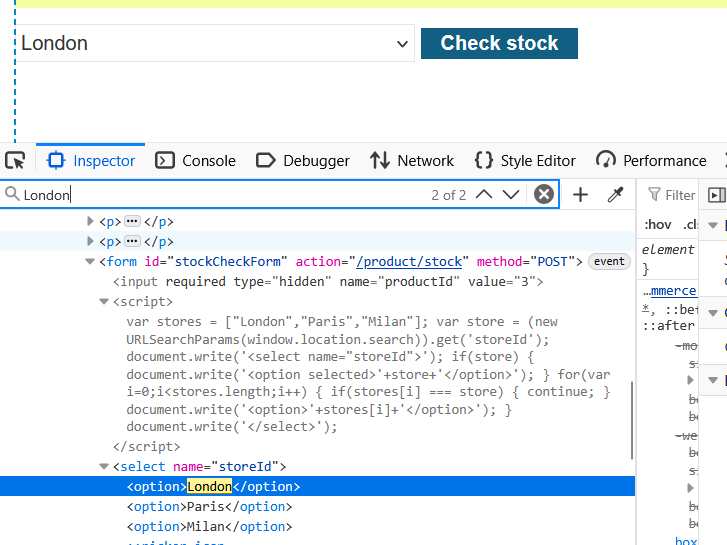
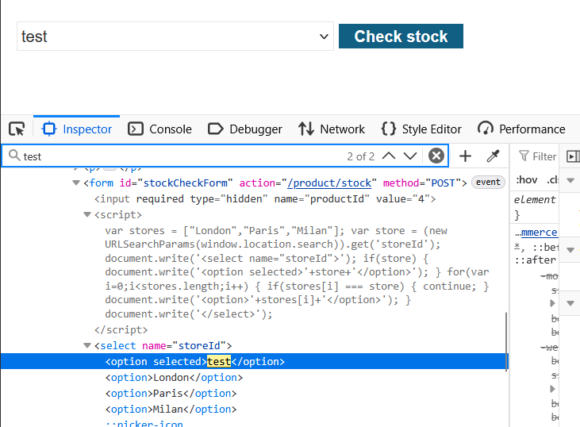
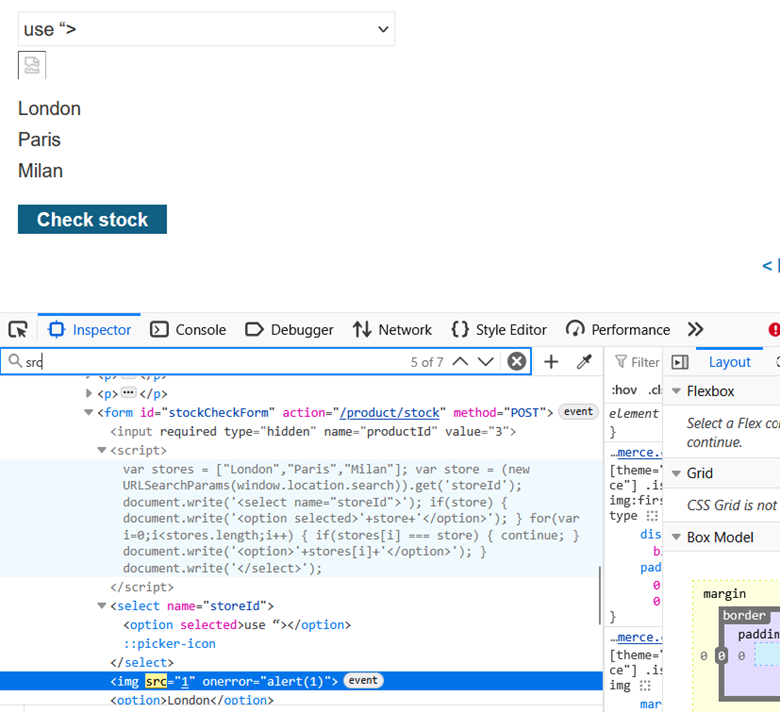

# LAB-10 DOM XSS in `document.write` Sink Using `location.search` Inside a `select` Element

## LAB : [PortSwigger Lab 10 Link](https://portswigger.net/academy/labs/launch/20f0960254c2299d1e38d95c6131eed58e897552311335c61ea0c8d324d7ca71?referrer=%2fweb-security%2fcross-site-scripting%2fdom-based%2flab-document-write-sink-inside-select-element)

## What?

This lab contains a **DOM-based cross-site scripting (XSS)** vulnerability in the stock checker functionality.

The application extracts the `storeId` parameter from `location.search` and uses JavaScript's `document.write()` function to add data to the page.

The user-controlled value is written inside a `<select>` element as part of the stock location option.

The goal is to break out of the existing `select` context and inject HTML that executes `alert()`.

## Where?

* **Functionality:** Stock checker
* **Parameter:** `storeId`
* **Source:** `location.search`
* **Sink:** `document.write()`
* **Context:** HTML inside `<select>`
* **Authentication:** Not required
* **Type:** DOM-based XSS

## How did I find it?

I opened a product page and inspected the **Check stock** functionality.

The initial URL contained the product parameter:

`product?productId=3`

I inspected the stock checker elements and identified a `<select>` element containing the available store options.

The vulnerable JavaScript uses a `storeId` value from the URL and writes it into this HTML structure using `document.write()`.

## How did I verify it?

First, I added a `storeId` parameter with a harmless value:

`product?productId=3&storeId=test`

The value `test` appeared as an option in the stock checker dropdown.

This confirmed that the `storeId` parameter was reaching the page.

I then inspected the dropdown and confirmed that the input was being placed inside the `<select>` element.

After identifying the HTML context, I used the payload:

`"><\/select>`

URL-encoded version:

`product?productId=3&storeId="></select>`

The payload successfully escaped the `select` element, injected an `img` element, and triggered `alert(1)`.

## What happens?

The application uses `document.write()` to place the `storeId` value inside the stock checker's `<select>` element.

Conceptually, the application produces HTML similar to:

`<select>`

`<option>USER_INPUT</option>`

`</select>`

The payload begins with:

`">`

This breaks out of the existing HTML context.

The payload then closes the `<select>` element:

`</select>`

After leaving the original context, it injects:

``

The invalid image source triggers the `onerror` event, which executes:

`alert(1)`

The execution flow is:

`location.search → storeId → document.write() → break out of select → inject img → onerror → alert(1)`

## Why does it work?

The vulnerability exists because attacker-controlled data from `location.search` is passed to `document.write()` without sufficient context-aware protection.

The input is initially constrained by the surrounding `<select>` structure.

Therefore, simply injecting JavaScript is not enough. The payload first needs to escape the existing HTML context.

The payload:

`"></select>`

performs three important actions:

1. `"` and `>` break out of the existing context.
2. `</select>` closes the vulnerable `<select>` element.
3. `` injects an executable HTML element.

## Why did I test `storeId=test` first?

Using a harmless value such as:

`storeId=test`

helps identify exactly where the attacker-controlled input is inserted.

The value appeared in the stock checker dropdown, confirming that:

`storeId → page output`

was occurring.

Inspecting the element then revealed the surrounding HTML context.

This made it possible to construct a payload specifically for the `<select>` context instead of blindly trying different XSS payloads.

## Important Observation

The key challenge was that the input was not initially being inserted into a normal HTML body.

It was being written inside a `<select>` element.

Therefore, the attack required **breaking out of the existing HTML structure first**.

The successful payload was:

`"><\/select>`

The important concept is:

**Identify the context → escape the context → inject a suitable executable element.**

## What can an attacker do?

If this vulnerability were exploitable against another user, an attacker could potentially execute JavaScript in the security context of the vulnerable application.

Depending on the application's security controls and the victim's privileges, this could potentially allow:

* Performing actions as the victim
* Accessing sensitive information available to JavaScript
* Manipulating page content
* Stealing information accessible to the script
* Chaining the XSS with other vulnerabilities

## What are the conditions/limitations?

* The attacker must be able to control the `storeId` parameter.
* The value must reach the vulnerable `document.write()` call.
* The input must not be safely encoded or sanitized.
* The payload must successfully escape the surrounding `<select>` context.
* The victim must access a URL containing the malicious parameter for the DOM XSS to execute.

## How should it be fixed?

* Avoid using `document.write()` with user-controlled data.
* Do not place untrusted URL parameters directly into HTML.
* Use safe DOM APIs such as `textContent` where appropriate.
* Validate `storeId` against an allowlist of legitimate store identifiers.
* Apply context-aware output encoding when HTML output is unavoidable.
* Use a strong **Content Security Policy (CSP)** as defense-in-depth.

## What did I learn?

* `location.search` can provide attacker-controlled input to DOM-based XSS.
* `document.write()` is dangerous when used with untrusted data.
* The surrounding HTML context determines how the payload must be constructed.
* A `<select>` element can restrict how injected markup is interpreted.
* Breaking out of the existing element can allow injection of a new executable element.
* `` can be used after escaping the vulnerable context.
* Testing with a harmless value such as `storeId=test` helps identify the exact injection point.
* The general DOM XSS process is **source → sink → context identification → context breakout → execution**.

## What was the key obstacle?

The main obstacle was recognizing that the `storeId` value was being inserted inside a `<select>` element.

Initially, the value had to be tested with a harmless string to determine its exact location.

After inspecting the resulting HTML, I realized that the payload needed to escape the existing `<select>` element before injecting an executable HTML element.

The final payload:

`"><\/select>`

escaped the existing context, injected the image element, triggered its error handler, and solved the lab.
