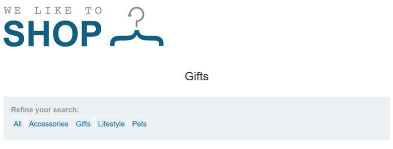
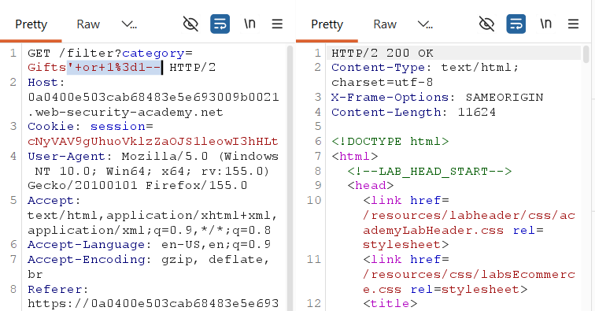

## LAB-1 SQL INJECTION VULNERABILITY IN WHERE CLAUSE ALLOWING RETRIEVAL OF HIDDEN DATA

## LAB : [Portswigger Lab 1 Link](https://portswigger.net/web-security/sql-injection/lab-retrieve-hidden-data)

## What?
String-based SQL Injection in the product category filter. The application takes user-supplied input and concatenates it directly into a SQL WHERE clause, allowing an attacker to alter query logic and retrieve data outside the intended scope.

## Where?
•	Page: `/filter` (product listing)

•	Method: `GET`

•	Parameter: `category` (query string)

•	No auth required

## How did I find it?
I intercepted the category selection in Burp Suite and noticed category=Gifts in the URL. I replaced Gifts with a single quote (') and the server responded with a 500 Internal Server Error. A syntax error on a single quote strongly suggests the input is being parsed as part of a SQL statement.

## How did I verify it?

I changed the parameter to:
`category=' OR 1=1--`
The page now displayed all products, including unreleased ones. The OR `1=1` made the WHERE clause always true, and `--` commented out the AND released `= 1` restriction. The appearance of previously hidden products confirmed successful injection.

## Why does it work?
The backend builds the query by directly embedding user input into the SQL string:
`SELECT * FROM products WHERE category = 'Gifts' AND released = 1`
When I injected `' OR 1=1--`, the database interpreted my input as executable SQL rather than plain data. There is no separation between code and data — the query is constructed dynamically without parameterization.

## What can an attacker do?
•	Bypass business-logic filters (e.g., view unreleased products)
•	Enumerate the entire products table using UNION SELECT
•	Potentially read other tables or sensitive fields if the database user has broader permissions

## What are the conditions/limitations?
•	Unauthenticated — anyone can reach the filter page
•	The injection occurs inside single quotes (string context), so the payload must close the quote first
•	The database accepts -- as a comment delimiter
•	Error responses are visible, making detection easier; blind exploitation would require different techniques

## How should it be fixed?
Primary: Use a parameterized query so user input is bound as data, not SQL:
`SELECT * FROM products WHERE category = ? AND released = 1`
Defense-in-depth: Whitelist allowed category values; use an ORM; restrict database user privileges to least-required access.

## What did I learn?
I initially thought a 500 error was just a generic crash, but here it was the best confirmation that SQL syntax was being broken. I also realized that -- is a quick way to neutralize trailing AND conditions in WHERE clauses. On a real target, I will now treat any filter parameter that throws a database error on a quote as a high-priority SQLi candidate.

## What was the key obstacle?
None — this is a classic, unfiltered string-context SQLi. The only "obstacle" is recognizing that the error response itself is the proof, not just the successful payload. This lab teaches you to trust syntax errors as diagnostic signals.
