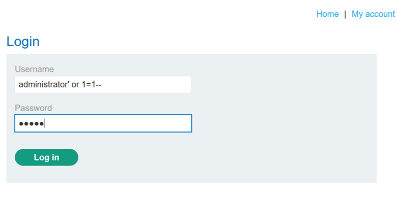

## LAB-2 SQL INJECTION VULNERABILITY ALLOWING LOGIN BYPASS

## LAB : [PortSwigger Lab 2 Link](https://portswigger.net/web-security/sql-injection/lab-login-bypass)

## What?

Authentication bypass via SQL Injection in the login form. The username field
is vulnerable to injection, allowing an attacker to log in as any user without
knowing the password.

## Where?

* **Page:** `/login`
* **Method:** `POST`
* **Parameter:** `username`
* **No prior auth required**

## How did I find it?

I intercepted the login request in Burp Suite and tested the username field
with a single quote (`'`) alongside a dummy password. The response behavior
(successful login or different error pattern) indicated the input was being
injected into a SQL query.

## How did I verify it?

I modified the username parameter to:

`administrator'--` or `administrator' or 1=1--`

and submitted any random password. The application logged me
in as the **administrator** user. The payload commented out the password
check, so the backend query matched the username without validating the password.

## Why does it work?

The backend query likely looks like:

`SELECT * FROM users WHERE username = 'administrator' AND password = '...'`

With the payload, it becomes:

`SELECT * FROM users WHERE username = 'administrator'--' AND password = '...'`

The `--` comments out the `AND password = '...'` clause. The
query now only checks if the username exists, ignoring password validation
entirely.

## What can an attacker do?

* Log in as **any user** (including administrator) without credentials
* Gain full administrative access to the application
* Pivot to higher-privilege functionality (user management, data export, configuration changes)

## What are the conditions/limitations?

* **Unauthenticated** — anyone can reach the login page
* The injection is in a **string context** (username wrapped in quotes)
* The database accepts `--` as a comment delimiter
* You must know a **valid username** (e.g., administrator) — the query still checks username existence

## How should it be fixed?

**Primary:** Use **parameterized queries** for both username and
password:

`SELECT * FROM users WHERE username = ? AND password = ?`

**Defense-in-depth:**

* Store passwords as **hashed values** with strong algorithms (bcrypt/Argon2)
* Implement **multi-factor authentication (MFA)**
* Enforce account lockout after failed attempts
* Use prepared statements so input is never treated as SQL code

## What did I learn?

I learned that `--` after a valid username completely neutralizes the password
check. I also noticed that knowing a valid username (like administrator) is
often enough — you don't need the password at all. On a real target, I will now
test login forms with `validuser'--` early in recon, especially when usernames
are predictable or enumerable.

## What was the key obstacle?

Knowing the **target username**. The lab tells you to aim for administrator,
but in the wild you might need to enumerate usernames first (via registration
errors, password reset, or IDOR). This lab simplifies that step and focuses
purely on the injection mechanics.
