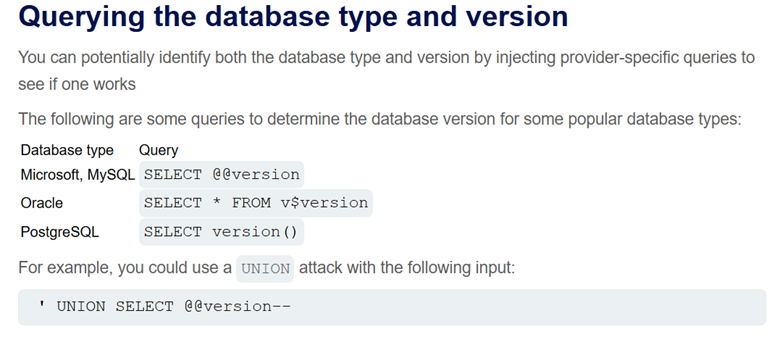
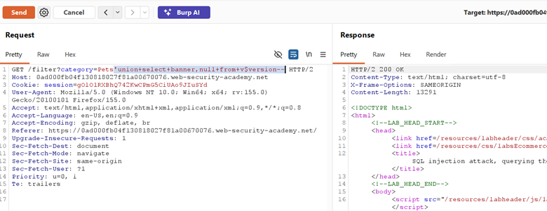

## LAB-3 SQL INJECTION ATTACK, QUERYING THE DATABASE TYPE AND VERSION ON ORACLE

## LAB : [PortSwigger Lab 3 Link](https://portswigger.net/web-security/sql-injection/union-attacks/lab-retrieve-data-from-specific-columns)

## What?

UNION-based SQL Injection in the product category filter on an **Oracle**
database. The attacker can append a crafted UNION SELECT to extract system
information, specifically the database version string.

## Where?

* **Page:** `/filter` (product listing)
* **Method:** `GET`
* **Parameter:** `category` (query string)
* **No auth required**

## How did I find it?

Same pattern as Lab 1: intercepted the category request, tested `category='` →
error confirmed SQL context. Since the output displays product data (name,
description, etc.), a **UNION attack** is viable — the page has room to
render extra query results.

## How did I verify it?

**Step 1 — Find column count and text columns:**

`' UNION SELECT 'abc','def' FROM dual--`

The page displayed `abc` and `def` in the product slots,
confirming **2 columns, both text-compatible**.

**Step 2 — Extract version:**

`' UNION SELECT BANNER, NULL FROM v$version--`

The page displayed the Oracle version string (e.g., Oracle
Database...) in the product output area.

## Why does it work?

The backend query:

`SELECT * FROM products WHERE category = 'Gifts'`

With injection becomes:

`SELECT * FROM products WHERE category = '' UNION SELECT BANNER, NULL FROM v$version--'`

* The original query returns zero rows (no category matches `''`)
* `UNION` appends the attacker-controlled query results
* Oracle requires `FROM dual` when selecting literal values without a real table
* `v$version` is a built-in Oracle view containing the database version banner

## What can an attacker do?

* Fingerprint the exact database version to search for known CVEs
* Enumerate all database tables using `all_tables`
* Extract sensitive application data via `UNION SELECT`
* Pivot to more advanced attacks if version is outdated and unpatched

## What are the conditions/limitations?

* **Oracle-specific syntax** required: `FROM dual` for literal selects, `v$version` for version info
* Must match **exact column count** (2) and **compatible data types** (text in both columns)
* The injection is in a **string context** (single quotes)
* Output must be **reflected on the page** for UNION to be useful (error-based or blind would need different techniques)

## How should it be fixed?

**Primary:** Use **parameterized queries** so category is treated as
data, not SQL.

**Defense-in-depth:**

* Restrict database user privileges (read-only on necessary tables, no access to `v$version` or `all_tables` from app account)
* Enable database activity monitoring for anomalous UNION patterns

## What did I learn?

Oracle is **picky** — every SELECT needs a FROM clause, so `FROM dual` is
mandatory for probing column counts with literal strings. I also learned that
`v$version` holds the banner string, and matching column count + data type is a
prerequisite before any UNION extraction works. On a real target, I will now
fingerprint the DBMS early (via error messages or version queries) because
Oracle, MySQL, and PostgreSQL each have different system tables and syntax
rules.

## What was the key obstacle?

**Oracle syntax differences.** Unlike MySQL/PostgreSQL, Oracle throws errors
if you omit FROM in a SELECT. I had to use `FROM dual` just to test column
counts. Also, `v$version` is Oracle-specific — on MySQL I would use `@@version`, on
PostgreSQL `version()`. This lab taught me that **knowing the DBMS type changes your entire payload set**.
