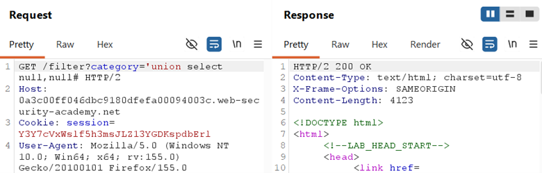
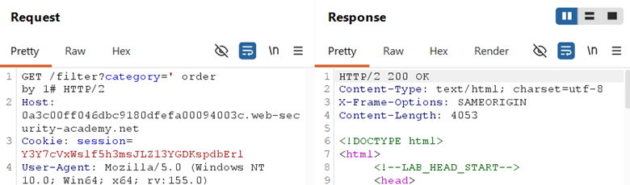
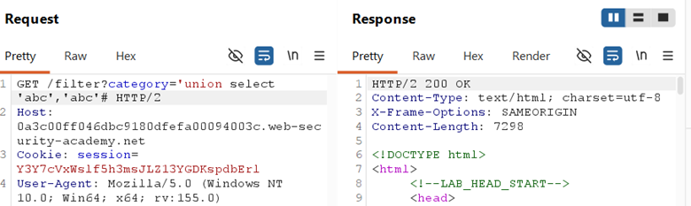
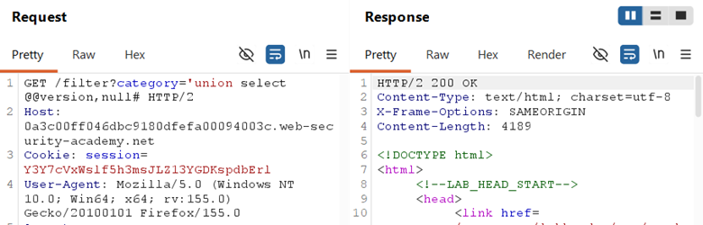

## LAB-4 SQL INJECTION ATTACK, QUERYING THE DATABASE TYPE AND VERSION ON MYSQL OR MICROSOFT SQL SERVER

## LAB : [PortSwigger Lab 4 Link](https://portswigger.net/web-security/sql-injection/union-attacks/lab-retrieve-multiple-values-in-single-column)

## What?

UNION-based SQL Injection in the product category filter, targeting **MySQL or
Microsoft SQL Server**. The attacker can append a UNION SELECT to extract the
database version string.

## Where?

* **Page:** `/filter` (product listing)
* **Method:** `GET`
* **Parameter:** `category` (query string)
* **No auth required**

## How did I find it?

Intercepted the category request, tested `category='` → error confirmed SQL
context. The page displays product data with multiple fields, making UNION
extraction viable.

## How did I verify it?

**Step 1 — Find column count and text columns:**

Choose one of them for finding no of columns in table.

`' UNION SELECT 'abc','def'#`

The page displayed `abc` and `def` in the product output,
confirming **2 columns, both text-compatible**.

**Step 2 — Extract version:**

`' UNION SELECT @@version,NULL#`

The page displayed the database version string in the
product output area.

## Why does it work?

The backend query:

`SELECT * FROM products WHERE category = 'Gifts'`

With injection becomes:

`SELECT * FROM products WHERE category = '' UNION SELECT @@version,NULL-- '`

* The original query returns zero rows (no category matches `''`)
* `UNION` appends the attacker-controlled query
* `@@version` is a built-in variable for both **MySQL** and **Microsoft SQL Server**
* `#` (MySQL) or `--` (Microsoft) comments out the trailing query logic
* Unlike Oracle, no `FROM dual` is needed for literal selects

## What can an attacker do?

* Fingerprint the exact database version to find known CVEs
* Enumerate all tables via `information_schema.tables` (MySQL) or `sys.tables` (MSSQL)
* Extract sensitive data via stacked or UNION queries
* Pivot to advanced attacks if the version is outdated

## What are the conditions/limitations?

* **MySQL/Microsoft syntax** — `@@version` works for both, but comment style differs (`#` vs `--`)
* Must match **exact column count** (2) and **compatible data types**
* The injection is in a **string context** (single quotes)
* Output must be **reflected on the page** for UNION to work

## How should it be fixed?

**Primary:** Use **parameterized queries** so category is bound as data,
not SQL.

**Defense-in-depth:**

* Restrict database user privileges (no access to system variables or metadata tables)
* Monitor for anomalous UNION patterns in query logs

## What did I learn?

MySQL and Microsoft SQL Server are **more forgiving** than Oracle — no `FROM
dual` needed for literal SELECT probes. I also learned that `@@version` is shared
syntax between MySQL and MSSQL, but **comment syntax differs** (`#` for MySQL,
`--` for Microsoft). On a real target, I will test both comment styles if the
DBMS type is unknown. The `#` comment is a quick MySQL fingerprint.

## What was the key obstacle?

**DBMS ambiguity.** The lab doesn't tell you if it's MySQL or Microsoft. I
had to reason that `@@version` works for both, but the `#` comment style strongly
suggests MySQL. If `--` had worked instead, it would point toward Microsoft. This
lab taught me to **use comment syntax as a DBMS fingerprinting tool** when
the backend type is unknown.
