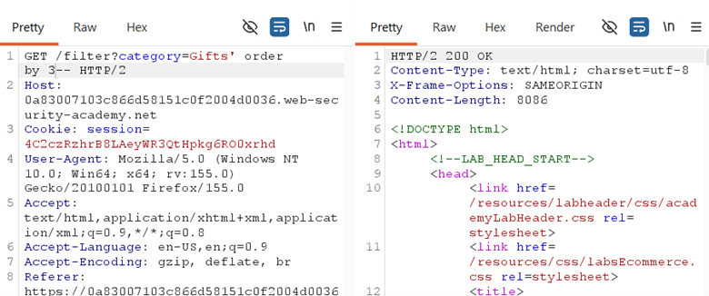
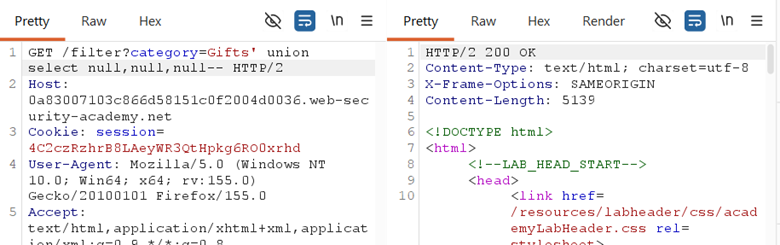
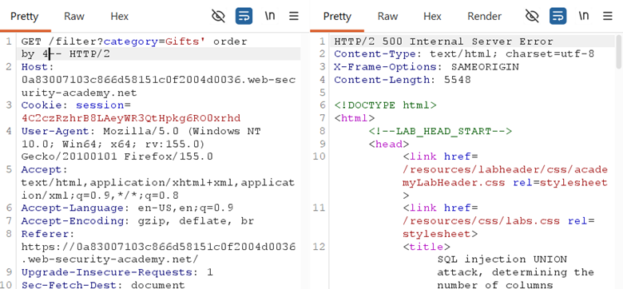

## LAB-7 SQL INJECTION UNION ATTACK, DETERMINING THE NUMBER OF COLUMNS RETURNED BY THE QUERY

## LAB : [PortSwigger Lab 7 Link](https://portswigger.net/web-security/sql-injection/union-attacks/lab-determine-number-of-columns)

## What?

SQL Injection reconnaissance technique to determine the **exact number of
columns** returned by the original query. This is a prerequisite for any
UNION-based data extraction attack.

## Where?

* **Page:** `/filter` (product listing)
* **Method:** `GET`
* **Parameter:** `category` (query string)
* **No auth required**

## How did I find it?

Intercepted the category request, confirmed SQL context with a single quote.
Since the page displays multiple data fields (product name, description, price,
etc.), a UNION attack was potentially viable — but only if I matched the exact
column count.

## How did I verify it?

**Method 1 — ORDER BY enumeration:**

`' ORDER BY 1--` → `200 OK`

`' ORDER BY 2--` → `200 OK`

`' ORDER BY 3--` → `200 OK`

`' ORDER BY 4--` → `500 Internal Server Error`

→ The query has **exactly 3 columns**. Column 4 does not
exist, so the database throws an error.

**Method 2 — UNION SELECT NULLs:**

`' UNION SELECT NULL--`
→ error (column count mismatch)

`' UNION SELECT NULL,NULL--`
→ error (column count mismatch)

`' UNION SELECT NULL,NULL,NULL--` → `200 OK` (page loads with extra null row)

→ Confirmed **3 columns**. The page displayed an extra
blank/null product entry, proving the UNION succeeded.

## Why does it work?

The backend query:

`SELECT col1, col2, col3 FROM products WHERE category = 'Gifts'`

* `ORDER BY 4` tries to sort by a non-existent 4th column → database error
* `UNION SELECT NULL,NULL,NULL` appends a 3-column row to the 3-column result set → success
* `NULL` is used because it is **type-agnostic** — it matches any data type (string, integer, date), so you don't need to know column types yet

## What can an attacker do?

* Determine the exact column count needed for UNION attacks
* Once column count is known, replace NULLs with actual data to extract information
* Use this as the first step in every UNION-based SQLi scenario

## What are the conditions/limitations?

* **Error responses must be visible** for ORDER BY to work as an indicator
* Some databases handle ORDER BY differently in subqueries or complex statements
* `NULL` works across all major DBMS types (MySQL, PostgreSQL, Oracle, MSSQL)
* On Oracle, you still need `FROM dual` when using UNION SELECT with literals later

## How should it be fixed?

**Primary:** Use **parameterized queries** so category is bound as data.

**Defense-in-depth:**

* Implement generic error handling that does not expose database error details
* Monitor for ORDER BY and UNION SELECT NULL patterns in query logs

## What did I learn?

I learned two complementary techniques: ORDER BY for **error-based column
counting** and UNION SELECT NULL for **confirmation**. ORDER BY is faster
for finding the count, but UNION SELECT NULL is the actual proof you need
before extracting data. I also learned why NULL is the safe choice for probing
— it avoids data type mismatches that would cause errors even if the column
count is correct.

## What was the key obstacle?

**Knowing which technique to trust.** I initially tried UNION SELECT 'abc'
and got errors, but that could have been a column-count issue OR a data-type
mismatch. Using NULL removes the data-type variable entirely. The ORDER BY
technique is faster for rough counting, but UNION SELECT NULL is the definitive
confirmation. This lab taught me to **always use NULLs for column-count
verification**, then switch to strings for actual data extraction.
