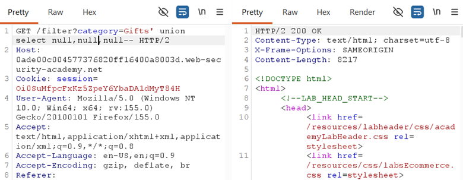
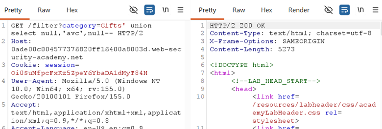
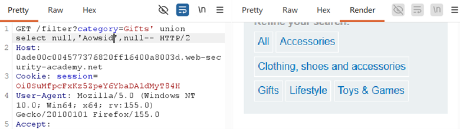

## LAB 8 — SQL INJECTION UNION ATTACK, FINDING A COLUMN CONTAINING TEXT

## LAB : [PortSwigger Lab 8 Link](https://portswigger.net/web-security/sql-injection/union-attacks/lab-find-a-column-containing-text)

## What?

UNION-based SQL Injection reconnaissance to identify which returned columns are
**compatible with string data**. This is the critical step between knowing
column count and actually extracting text data like usernames or passwords.

## Where?

* **Page:** `/filter` (product listing)
* **Method:** `GET`
* **Parameter:** `category` (query string)
* **No auth required**

## How did I find it?

First confirmed the query returned **3 columns** using:

`' UNION SELECT NULL,NULL,NULL--`

Then I tested each column position individually by replacing
one NULL at a time with a string (`'abc'`):

`' UNION SELECT 'abc',NULL,NULL--` → error (column 1 not text)

`' UNION SELECT NULL,'abc',NULL--` → `200 OK` (column 2 is text)

`' UNION SELECT NULL,NULL,'abc'--` → error (column 3 not text)

## How did I verify it?

The lab provided a random string: **Aowsid**. I placed it in the confirmed
text column:

`' UNION SELECT NULL,'Aowsid',NULL--`

The page loaded successfully and displayed `Aowsid` in the
product output area, proving column 2 accepts and renders string data.

## Why does it work?

The backend query:

`SELECT col1, col2, col3 FROM products WHERE category = 'Gifts'`

* `NULL` is type-agnostic and fits any column type (integer, string, date)
* `'abc'` or `'Aowsid'` is a **string literal** — it only works in columns where the database expects text/varchar/char data
* If you put a string in an integer column, the database throws a type mismatch error
* By testing each position, you map which columns can hold the text data you want to extract later

## What can an attacker do?

* Identify exactly **where to place extracted data** in a UNION query
* Know which column position will display usernames, passwords, or other string data on the page
* Avoid wasting time trying to dump text into a numeric or date column

## What are the conditions/limitations?

* **Unauthenticated** — anyone can reach the filter
* You must already know the **exact column count** (from Lab 7)
* You need **visible error responses** to detect type mismatches
* Some databases are more lenient with implicit type conversion (e.g., MySQL may auto-convert strings in numeric contexts), which can give false positives

## How should it be fixed?

**Primary:** Use **parameterized queries** so category is bound as data.

**Defense-in-depth:**

* Generic error handling to hide database type mismatch errors
* Input validation to reject unexpected characters

## What did I learn?

I learned that **knowing column count is not enough** — you also need to
know which columns accept text. I initially thought any column could take a
string, but databases enforce data types. Testing one column at a time with a
simple string (`'abc'`) is the fastest way to map text-compatible positions. This
step is essential because when I extract usernames and passwords later, I need
to place them in the right column or the query will fail.

## What was the key obstacle?

**Data type mismatch.** When I put `'abc'` in the wrong column, I got an error
even though the column count was correct. This was confusing at first —
I thought my column count was wrong. The lesson: **column count and data type
are two separate checks**. Always probe with NULL first (count), then probe
with strings second (type compatibility).
