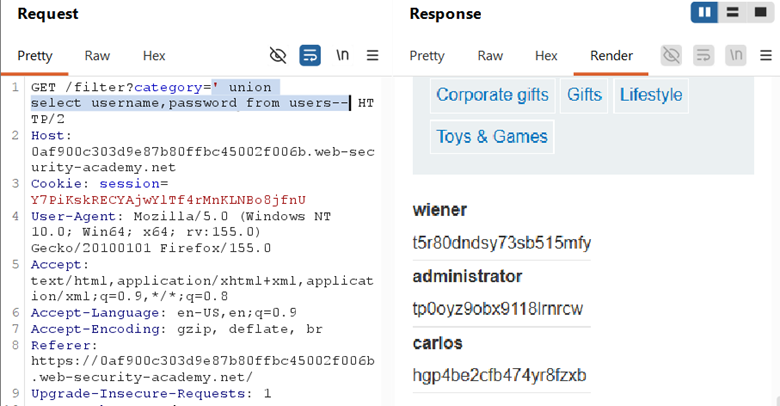

## LAB 9 — SQL INJECTION UNION ATTACK, RETRIEVING DATA FROM OTHER TABLES

## LAB : [PortSwigger Lab 9 Link](https://portswigger.net/web-security/sql-injection/union-attacks/lab-retrieve-data-from-other-tables)

## What?

UNION-based SQL Injection allowing cross-table data extraction. The attacker
can dump usernames and passwords from the users table by appending a UNION
SELECT to the product category query.

## Where?

* **Page:** `/filter` (product listing)
* **Method:** `GET`
* **Parameter:** `category` (query string)
* **No auth required**

## How did I find it?

Intercepted the category request, confirmed SQL context with a single quote.
The page displayed product data in multiple fields, indicating a UNION attack
was possible.

## How did I verify it?

**Step 1 — Confirm columns and text compatibility:**

`' UNION SELECT 'abc','def'--`

→ Confirmed **2 columns, both text-compatible**

**Step 2 — Extract credentials:**

`' UNION SELECT username,password FROM users--`

→ The page displayed all usernames
and passwords in the product listing area, including the administrator
credentials.

**Step 3 — Log in:**

Used the extracted administrator username and password to log in and complete
the lab.

## Why does it work?

The backend query:

`SELECT * FROM products WHERE category = 'Gifts'`

With injection becomes:

`SELECT * FROM products WHERE category = '' UNION SELECT username,password FROM users--`

* The original query returns zero rows (no category matches `''`)
* `UNION` appends all rows from the users table
* Both queries return 2 text columns, so the database merges them without error
* The application renders the injected data directly into the product listing HTML

## What can an attacker do?

* Dump entire tables from the database (users, orders, payment info, PII)
* Steal plaintext or hashed credentials
* Authenticate as administrator or any user
* Escalate to account takeover, privilege abuse, or further attacks

## What are the conditions/limitations?

* **Unauthenticated** — anyone can reach the filter
* Must match **exact column count** (2) and **compatible data types** (both text)
* The app DB user must have **read access** to the users table
* Output must be **reflected on the page** for UNION to work
* The table and column names were known/given (users, username, password)

## How should it be fixed?

**Primary:** Use **parameterized queries** so category is bound as data.

**Defense-in-depth:**

* Apply **principle of least privilege** — app DB user should only access necessary tables
* Hash passwords with strong algorithms (bcrypt/Argon2)
* Monitor for UNION SELECT patterns in query logs

## What did I learn?

This lab tied together everything from the previous labs: finding column count,
identifying text columns, and finally extracting real data. I learned that once
you know the schema (table name + column names), the actual data dump is
straightforward. The users table had predictable names in this lab, but in the
real world I would need to enumerate them first (as I did in Labs 5 and 6).

## What was the key obstacle?

**None — this was the synthesis lab.** All the hard work (column counting,
type checking, schema enumeration) was already done in previous labs. The only
requirement here was putting it all together. The lesson: **UNION injection is
a chain of steps** — miss any one step (count, type, schema) and the whole
attack fails. This lab proved I had mastered the full chain.
