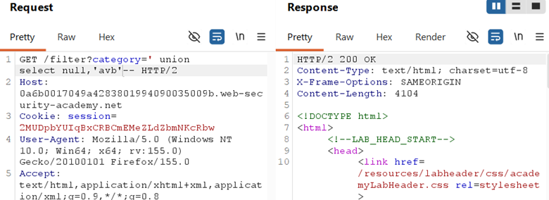
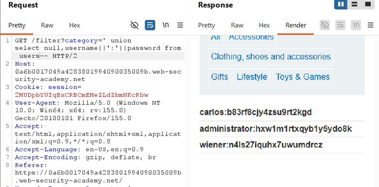

## LAB 10 — SQL INJECTION UNION ATTACK, RETRIEVING MULTIPLE VALUES IN A SINGLE COLUMN

## LAB : [PortSwigger Lab 10 Link](https://portswigger.net/web-security/sql-injection/union-attacks/lab-retrieve-multiple-values-in-single-column)

## What?

UNION-based SQL Injection where only **one column is text-compatible**.
Requires string concatenation to fit both username and password into a single text column.

## Where?

* **Page:** `/filter`
* **Method:** `GET`
* **Parameter:** `category`
* **No auth required**

## How did I find it?

Intercepted the request, confirmed SQL context. Probed column count and types:

` 
' UNION SELECT NULL,'abc'-- → 200 OK (column 2 is text)
`

`
' UNION SELECT 'abc',NULL-- → error (column 1 is not text)
`

→ Only **column 2 accepts text**.

## How did I verify it?

Concatenated both values into the single text column:

`
' UNION SELECT NULL,username||':'||password
FROM users--
`

→ Page displayed credentials like `administrator:p4ssw0rd` in the product description area.

## Why does it work?

The backend query returns 2 columns, but only one is text. The `||` operator concatenates username, a delimiter (`:`), and password into one string. This fits the single text column, while the first column gets `NULL` (type-agnostic).

## What can an attacker do?

* Extract multiple data fields even when the app only exposes one text column
* Dump full credential tables, PII, or any paired data

## Conditions / Limitations?

* Must know exact column count and which column is text
* DBMS-specific concatenation syntax (`||` for Oracle/PostgreSQL, `+` for MSSQL, `CONCAT()` for MySQL)
* App DB user must have read access to target table

## How to fix?

* **Primary:** Parameterized queries
* **Defense:** Least privilege, hash passwords, monitor for UNION patterns

## What did I learn?

Column count alone is not enough — **data type matters**. When only one column is text, concatenation is the workaround. I also learned to always probe with `'abc'` in each position to map type compatibility before planning extraction.

## Key obstacle?

Only **one text column available**. Previous labs had two; this one forced me to compress two values into one using concatenation. The delimiter (`:`) keeps the data readable and parseable.
