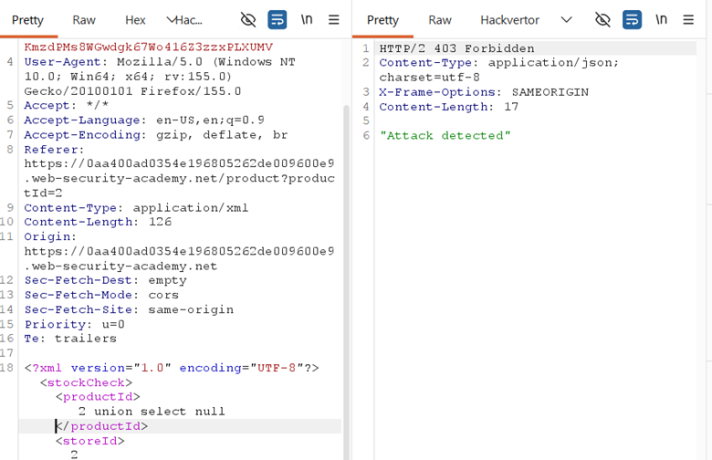
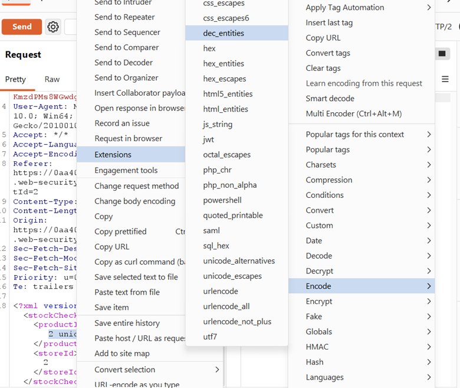
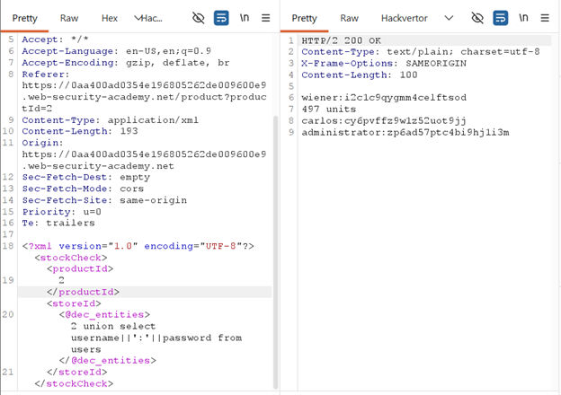
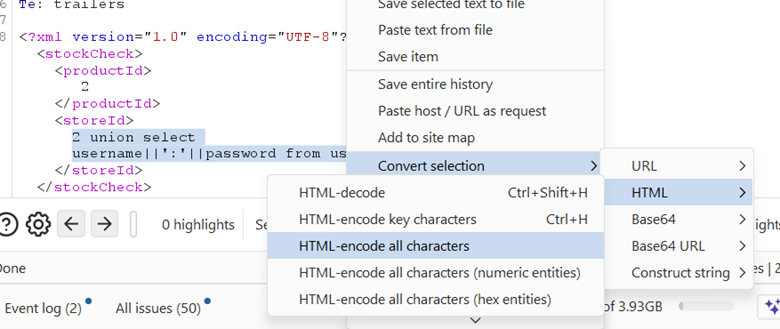
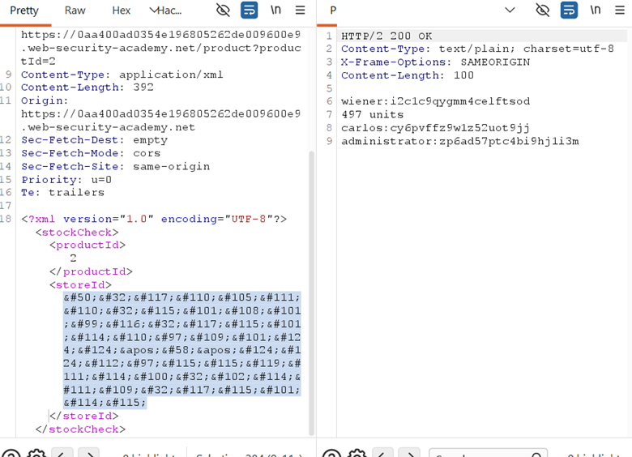

## LAB-11 SQL INJECTION WITH FILTER BYPASS VIA XML ENCODING

## LAB : [PortSwigger Lab 11 Link](https://portswigger.net/web-security/sql-injection/advanced-techniques/lab-sql-injection-with-filter-bypass-via-xml-encoding)

## What?

SQL Injection in the stock check feature's `storeId` XML parameter, blocked by a **WAF**.
Bypass achieved via **XML entity encoding** (decimal/hex entities or HTML encoding) to obfuscate the payload.

## Where?

* **Page:** Product stock check feature
* **Method:** `POST`
* **Parameter:** `storeId` (inside XML body)
* **No auth required**

## How did I find it?

Intercepted the stock check request. The `storeId` was sent in XML:

```xml
<storeId>1</storeId>
```

Tested with `1+1` → returned stock for store 2, proving **input is evaluated as SQL**.

Tried `1 UNION SELECT NULL` → **blocked by WAF** (flagged as attack).



## How did I verify it?

### Method 1 — Hackvertor extension:

Selected payload → Right-click → Extensions → Hackvertor → Encode → `dec_entities` or `hex_entities`.



Encoded `1 UNION SELECT NULL` sent successfully → WAF bypassed.



### Method 2 — Burp built-in HTML encode:

Selected payload → Right-click → Convert Selection → HTML → Encode all characters.



Same bypass result.



### Exploitation:

Confirmed only **1 column** returned (more than 1 returned 0 units/error).

Concatenated credentials into single column:

```xml
<storeId><@hex_entities>1 UNION SELECT username || '~' || password FROM users</@hex_entities></storeId>
```


→ Extracted credentials including administrator password: **zp6ad57ptc4bi9hj1i3m**

## Why does it work?

The WAF inspects raw request text for SQLi signatures (`UNION`, `SELECT`, etc.).
XML parsers **decode entity-encoded characters** before passing the value to the SQL query. So:

* `UNION` encoded as `&#85;&#78;&#73;&#79;&#78;` (decimal) or `&#x55;&#x4E;&#x49;&#x4F;&#x4E;` (hex) passes WAF inspection
* The XML parser decodes it back to `UNION` before SQL execution
* The database receives the raw SQLi payload while the WAF sees harmless entities

## What can an attacker do?

* Bypass WAFs that rely on signature matching
* Execute full UNION-based data extraction despite filtering
* Dump credentials, PII, or any accessible data
* The bypass technique applies to any XML-injected parameter

## What are the conditions/limitations?

* The injection point must be inside an **XML context** (XML parser decodes entities)
* WAF must be **signature-based** (not behavior-based or semantic analysis)
* Only **1 column** available in this query, requiring concatenation
* The app DB user must have read access to the users table

## How should it be fixed?

**Primary:** Use **parameterized queries** so `storeId` is bound as data, not SQL.

**Defense-in-depth:**

* WAF should **decode XML entities before inspection** (normalize input)
* Use a WAF with semantic SQLi detection, not just signature matching
* Apply principle of least privilege on DB user
* Input validation on `storeId` (should be numeric only)

## What did I learn?

I learned that **WAFs can be bypassed** if they inspect raw traffic without understanding the transport format. XML entity encoding is a classic bypass because the WAF sees `&#85;` (harmless) while the parser sees `U`. I also learned that Hackvertor and Burp's built-in encoders are essential tools for this. On a real target, I will now test encoding variations (URL encode, HTML entities, Unicode, XML entities) whenever a WAF blocks my payloads.

## What was the key obstacle?

**The WAF blocking raw SQL keywords.** My standard UNION SELECT payload was instantly rejected. The key realization was that the parameter was inside XML, so **XML entity encoding** would be decoded by the parser before reaching SQL. This lab taught me to think about **where the payload is parsed** (WAF vs. XML parser vs. SQL engine) and to encode for the layer that inspects, not the layer that executes.
