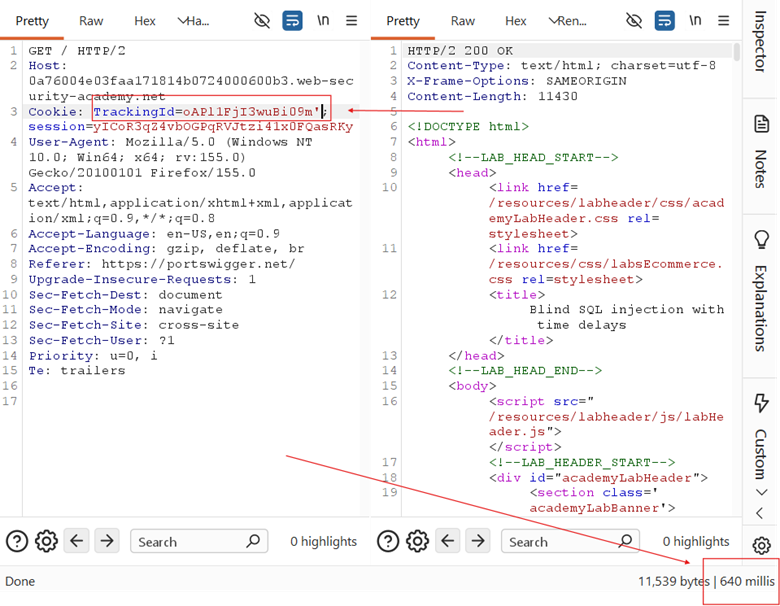
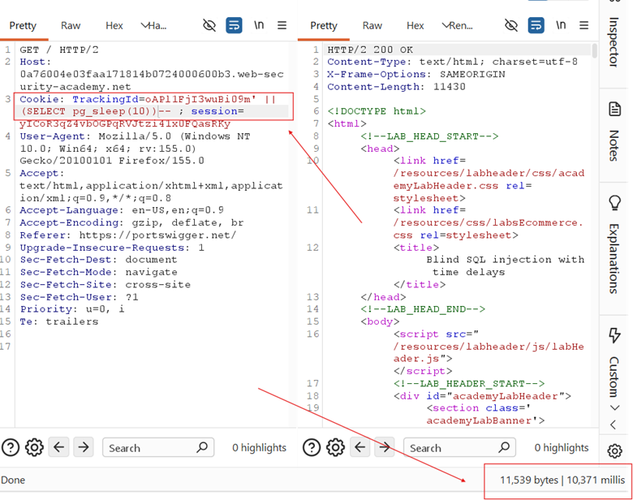

## LAB 15 — BLIND SQL INJECTION WITH TIME DELAYS

## LAB : [PortSwigger Lab 15 Link](https://portswigger.net/web-security/sql-injection/blind/lab-time-delays)

## What?

**Time-based Blind SQL Injection** in the `TrackingId` cookie on a **PostgreSQL** database. The application returns **no query results**, **no error messages**, and **no boolean signals** — the only observable difference is the **response time**.

## Where?

* **Page:** Front page of the shop
* **Method:** `GET` (cookie-based)
* **Parameter:** `TrackingId` cookie
* **No auth required**

## How did I find it?

### Step 1 — Test for SQL injection:

* `TrackingId=xyz'` → **200 OK, ~0.6s** (no delay, no error)
* The single quote did not cause a visible error or time delay → this is a **true blind** scenario



### Step 2 — Test time delay payloads for each database:

| **Database**   | **Payload**                           | **Result**            |
| -------------- | ------------------------------------- | --------------------- |
| Oracle         | `dbms_pipe.receive_message(('a'),10)` | No delay              |
| Microsoft      | `WAITFOR DELAY '0:0:10'`              | No delay              |
| **PostgreSQL** | **`pg_sleep(10)`**                    | **✅ 10 second delay** |
| MySQL          | `SLEEP(10)`                           | No delay              |

**Working payload:**

```plain id="7q2m5x"
TrackingId=x'||pg_sleep(10)--
```



**Result:** Application took **~10 seconds** to respond → confirmed PostgreSQL with time-based injection.

## Why does it work?

The backend query:

```sql id="3n8v1k"
SELECT
* FROM tracking WHERE id = 'x'||pg_sleep(10)--'
```

* `x'||pg_sleep(10)` — the `||` is PostgreSQL string concatenation
* `pg_sleep(10)` is a PostgreSQL function that **pauses execution for 10 seconds**
* The database waits 10 seconds before returning any result
* The application waits synchronously for the database → response is delayed by 10 seconds
* `--` comments out the trailing quote

## What can an attacker do?

* **Infer data bit by bit** using conditional time delays:

```sql id="9c4w6p"
'||CASE
WHEN (SELECT SUBSTRING(password,1,1) FROM users WHERE
username='administrator')='a' THEN pg_sleep(10) ELSE pg_sleep(0) END--
```

* If response takes ~10s → condition is **true**
* If response takes ~0s → condition is **false**
* Repeat for every character position to reconstruct the full password
* Works even when **no output, no errors, and no boolean signals** exist

## What are the conditions/limitations?

* **Truly blind** — no output, no errors, no content differences at all
* Query must execute **synchronously** (database blocks until `pg_sleep` finishes)
* Network latency and server load can cause **false positives/negatives**
* Very **slow** — each bit requires a full request + wait time
* Must know the **database type** to use the correct delay function
* The `TrackingId` must support string concatenation (`||` in PostgreSQL/Oracle)

## How should it be fixed?

**Primary:** Use **parameterized queries** so `TrackingId` is bound as data.

**Defense-in-depth:**

* Set **query timeouts** on the database (e.g., `statement_timeout` in PostgreSQL)
* Use **asynchronous query processing** where possible
* Monitor for anomalous response times (WAF/IDS can detect time-based patterns)
* Never expose synchronous database queries directly to user input

## What did I learn?

I learned that **time is a valid information channel**. When there's no output, no errors, and no boolean signals, the only thing left is **how long the server takes to respond**. I also learned to **always test all database delay functions** — I tried Oracle, Microsoft, MySQL, and PostgreSQL payloads before finding the right one. The `pg_sleep()` function is PostgreSQL-specific; on MySQL it would be `SLEEP()`, on MSSQL `WAITFOR DELAY`, on Oracle `dbms_pipe.receive_message()`. Knowing the DBMS type is critical for time-based attacks.

## What was the key obstacle?

**Complete absence of any feedback.** No 500 errors, no "Welcome back" messages, no content changes — just a normal 200 response every time. The only way to confirm injection was to make the database **wait**. The `pg_sleep(10)` payload was the breakthrough because it proved the query was executing my injected code. Without the time delay, I would have no way to know if the injection point existed at all.
